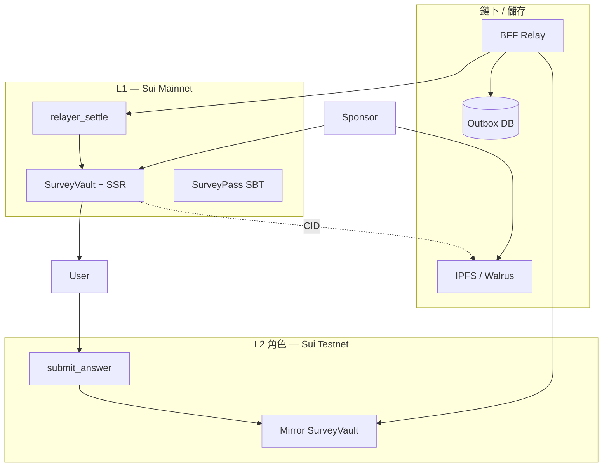
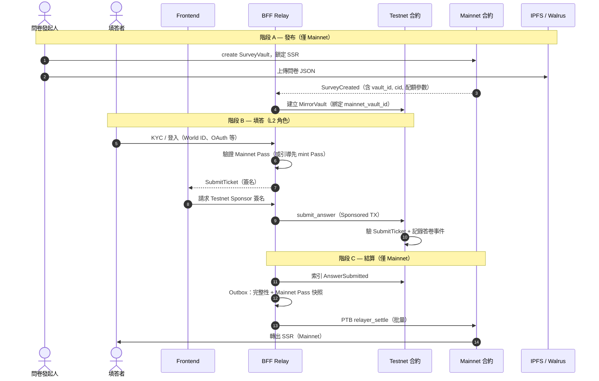

# 專案跨網路方案（Mainnet + Testnet L2 角色）

> **文件狀態**：目標架構（Target Architecture）  
> **與現況**：MVP 目前以單網（Devnet）部署，問卷 `claim` 與 Gas Station 代付已於同鏈實作；本方案為下一階段「雙網 + 中繼結算」的設計基線。  
> **相關文件**：[專案 SurveyPass 方案.md](./專案%20SurveyPass%20方案.md)、[改版備忘.md](./改版備忘.md)

---

## 1. 目的與範圍

SurveySui 的「跨網路方案」**不是在 Sui 上建官方 L2**，也**不在 Mainnet 與 Testnet 之間橋接 SSR 資金**。

在本專案語意下，我們讓 **Sui Testnet 扮演 Mainnet 的 L2 角色**：

| 層級 | 網路 | 專案中的 L2 / L1 職責 |
|------|------|------------------------|
| **L1（信任與價值）** | Sui Mainnet | 問卷發布、SSR 鎖倉與發放、SurveyPass 正式 SBT、配額與防女巫的最終裁決 |
| **L2（執行與成本）** | Sui Testnet | 高頻、低價值 Gas 的填答憑證、鏡像 Vault 去重、答卷事件；不承載真實 SSR |

**安全**來自：Mainnet 合約規則 + BFF 簽名閘道 + 結算時再次驗證 Pass／配額。  
**省成本**來自：受訪者操作在 Testnet（由項目方 Testnet Sponsor 代付），Mainnet 僅由 Relayer 批量結算。



---

## 2. 「L2 角色」的精確定義（專案用語）

### 2.1 我們宣稱的「安全」指什麼

| 威脅 | L2（Testnet）負責 | L1（Mainnet）負責 |
|------|-------------------|-------------------|
| 繞過 BFF 狂刷答卷 | `SubmitTicket` 鏈上驗簽 + Mirror Vault 位址／nullifier 去重 | — |
| 同一真人重複領獎 | Mirror 初步去重（減少垃圾進 Outbox） | `used_nullifiers`、配額、`relayer_settle` 冪等鍵 |
| 發放未授權 SSR | Testnet 不發真實 SSR | `RelayerCap` 僅能 `relayer_settle` 至已驗證地址 |
| 答卷內容篡改 | Ticket 綁定 `answers_commitment`、問卷 CID | 結算時帶相同 commitment |
| BFF 被攻破 | 攻擊者仍無法偽造有效 Ticket（需 ticket key） | Relayer 額度上限、無任意提現 |

Testnet **不提供**與 Mainnet 等價的經濟安全（Testnet 幣無價值、鏈可重置）。  
專案所說的「安全」，是指 **價值與身份的最終真相只在 Mainnet**，Testnet 只是受控的執行層。

### 2.2 我們宣稱的「省成本」指什麼

- 受訪者：**不付 Mainnet SUI**；填答 Gas 由 **Testnet Gas Sponsor**（BFF 囤測試幣 + Sponsored Transaction）代付。
- 項目方：Mainnet 以 **PTB 批量 `relayer_settle`** 摊薄固定 Gas；問卷正文放 IPFS/Walrus，Mainnet 只存 CID。
- 發起人：SSR 質押與配額管理仍在 Mainnet 一處完成，無需雙邊鎖倉。

### 2.3 與鏈原生 L2 的差異（對外說明用）

對外簡報可稱「Testnet 作為執行層、Mainnet 作為結算層」；技術文件應註明：  
**沒有**跨鏈狀態根驗證、**沒有**強制排序繼承，**有** BFF 中繼與密碼學綁定。信任邊界在 **BFF + Mainnet 合約**，不在 Testnet 共識本身。

---

## 3. 端到端流程

### 3.1 總覽序列



### 3.2 階段 A — 發布端（Mainnet + 去中心化儲存）

**發起人（Mainnet）**

1. 在 Mainnet 建立 `SurveyVault`，鎖定 SSR、設定 `per_response`、配額、截止時間、Gas 補償參數（與現有合約語意對齊）。
2. 問卷本體（題目、選項、邏輯）上傳 **IPFS 和／或 Walrus**；Mainnet Vault 僅保存 **CID** 與 hash。

**BFF（跨網同步）**

3. 監聽 Mainnet `SurveyCreated`（或輪詢 Vault 註冊表）。
4. 在 Testnet 部署對應 **MirrorVault**，寫入不可變欄位：
   - `mainnet_vault_id`（權威鍵）
   - `content_cid` / `content_hash`
   - `deadline_ms`、`max_responses`（自 Mainnet 讀取，定期同步剩餘配額）
5. 同步失敗則 **禁止** 對該問卷簽發 `SubmitTicket`。

### 3.3 階段 B — 填答端（Testnet，L2 執行層）

**受訪者體驗目標**：零 Mainnet Gas、免領水龍頭、盡量減少手動切網。

| 步驟 | 說明 |
|------|------|
| 載入問卷 | FE 從 CID 拉題目；顯示問卷來自 Mainnet `vault_id` |
| 身份 | 填答前 BFF 確認用戶在 **Mainnet** 持有有效 `SurveyPass`（見 §5） |
| 取得 SubmitTicket | BFF 用 **ticket key** 簽名（與 Pass mint ticket 分開 payload，見 §4.2） |
| 上鏈 | FE 組 `submit_answer` PTB，經 **Testnet Gas Sponsor** 代付並廣播 |
| 鏈上 | MirrorVault 驗簽、檢查去重、發出 `AnswerSubmitted` 事件 |

**Gas 策略（定案）**

- **預設**：Testnet Sponsored Transaction（BFF Testnet sponsor 金鑰，與 Mainnet Relayer 金鑰分離）。
- **備援**：用戶自備 Testnet SUI（僅在 sponsor 額度耗盡時）；產品文案仍為「零 Mainnet 成本」。
- **錢包**：多數錢包需連到 Testnet RPC；透過 zkLogin / 產品內建錢包可隱藏「切網」細節，但底層仍是 Testnet 交易。

### 3.4 階段 C — 中繼與結算（BFF + Mainnet）

**BFF 管線**

1. **索引** Testnet `AnswerSubmitted`。
2. **鏈下驗證**：答卷完整、`answers_commitment` 與 Ticket 一致、問卷 CID 未變。
3. **Mainnet 真相檢查**（結算前再次執行）：
   - 用戶 **Mainnet** `SurveyPass` 仍 `is_valid`；
   - Mainnet Vault 仍有配額與 SSR 餘額；
   - `testnet_tx_digest` 尚未結算過。
4. **Outbox** 寫入待結算列；背景 worker 以 **Relayer 金鑰** 發送 Mainnet PTB。
5. **批量結算**：單筆 PTB 內多次 `relayer_settle`（筆數與間隔可配置，需 dry-run 估算 Gas）。

**Mainnet 結算（新合約能力，非現有 `claim`）**

現有 `survey_vault::claim` 要求填答者本人帶 **同鏈 Pass** 上鏈領獎，不適用跨網。跨網方案需新增：

```text
relayer_settle(
  vault,
  relayer_cap,
  recipient,              // Mainnet 地址（通常與 Testnet sender 相同）
  testnet_tx_digest,      // 冪等鍵
  answers_commitment,
  pass_nullifier_scoped,  // 與現有 vault 級去重一致
  clock,
)
```

- 僅持有 `RelayerCap` 的地址可呼叫。
- 合約內記錄 `testnet_tx_digest → settled`，防止重複發放。
- SSR 從 Vault 轉至 `recipient`；**不要求** Pass 物件出現在同一筆 TX（改以 nullifier／鏈下約束 + 結算時鏈上檢查欄位為準，細節在 Move TDD 定稿）。

**Testnet 不發 SSR**；MirrorVault 只記錄「已提交」，不模擬真實代幣轉帳。

---

## 4. 密碼學與資料綁定

### 4.1 跨網 ID 對照（權威來源：Mainnet）

| 欄位 | 權威鏈 | 說明 |
|------|--------|------|
| `mainnet_vault_id` | Mainnet | 問卷唯一識別 |
| `testnet_mirror_vault_id` | Testnet | 由 BFF 建立，映射表存 DB |
| `content_cid` | Mainnet Vault 記錄 | 問卷內容 |
| `testnet_tx_digest` | Testnet | 單次填答冪等鍵 |
| `answers_commitment` | Ticket + 事件 | `SHA256(encrypted_answers ‖ vault_id ‖ nonce)` |

任何結算請求必須同時攜帶上述綁定；缺一則 Outbox 拒絕。

### 4.2 兩種 Ticket（不可混用）

| 類型 | 用途 | 簽名金鑰 | 消費位置 |
|------|------|----------|----------|
| **PassIssuanceTicket** | mint / update SurveyPass | ticket key（INV-7） | 用戶自行送 TX；**預設 Mainnet** |
| **SubmitTicket** | 填答提交 | ticket key（可同一把，不同 payload type） | Testnet `submit_answer` |

**SubmitTicket** 建議欄位（BCS 結構，實作時凍結版本）：

- `mainnet_vault_id`
- `respondent`（address）
- `answers_commitment`
- `expires_at_ms`
- `nonce`

Testnet 合約只信任 ticket key 對應公鑰；與 Pass ticket 共用驗簽模組、不同 `type` 常數。

### 4.3 答卷與稽核

- 完整 `encrypted_answers` 可存 **Walrus / BFF 加密 DB**，鏈上只留 commitment。
- Mainnet `relayer_settle` 事件至少包含：`vault_id`、`recipient`、`testnet_tx_digest`、`answers_commitment`。
- 發起人稽核：CID + commitment + Testnet digest 三角定位。

---

## 5. SurveyPass 與跨網路

### 5.1 定案原則

| 項目 | 決策 |
|------|------|
| 正式 Pass（SBT） | **僅 Mainnet**；具防女巫效力與產品信任敘事 |
| Pass 申請 Gas | 優先 **Mainnet Gas Station**（已實作）；高頻草稿不走 Testnet 鏈上 |
| 填答資格 | BFF 簽 `SubmitTicket` 前查 **Mainnet** Pass；Testnet 填答 TX **不**攜帶 Pass 物件 |
| KYC 原始資料 | BFF DB（加密）；鏈上僅 commitment / nullifier（與 [專案 SurveyPass 方案.md](./專案%20SurveyPass%20方案.md) 一致） |

### 5.2 為何不把 Pass「草稿」放 Testnet

Sui Testnet 會 **定期 Reset**，鏈上草稿會消失。  
Pass 草稿狀態改為：**BFF DB（或 Walrus）+ 必要時一次性 Mainnet mint**；Testnet 只用於 **問卷填答憑證**，不用於 Pass 生命週期。

### 5.3 與 World ID / Tier 2

World ID 驗證仍在 BFF 完成（Orb-only 等政策不變）；通過後簽 **PassIssuanceTicket**，用戶在 **Mainnet** mint Pass。  
跨網填答只讀 Mainnet Pass 狀態，不在 Testnet 複製 Pass。

> 進階流程（Pass 更新、撤銷、跨網指引）可另立 `專案 Survey Pass 跨網路簽發指引.md`；**不阻塞**問卷 L2 填答主線。

---

## 6. 配額、資金與一致性

**單一真相來源（Source of Truth）**：Mainnet `SurveyVault` 的 `claimed_count`、SSR `balance`、`deadline_ms`。

| 情境 | 行為 |
|------|------|
| BFF 簽 SubmitTicket 前 | 讀 Mainnet 剩餘配額；為 0 則拒絕簽票 |
| Testnet 已提交但 Mainnet 配額滿 | Outbox 標記 `pending_quota`；不結算、不發 SSR |
| Mainnet SSR 不足 | Outbox `failed_insufficient_funds`；告警；可退還發起人或人工處理 |
| 結算時 Pass 已過期／撤銷 | 拒絕 `relayer_settle`；Testnet 記錄保留供稽核 |

Testnet MirrorVault 的去重是 **第一道過濾**，不能替代 Mainnet 的 nullifier 與配額。

---

## 7. 使用者可見狀態

| 狀態 | 說明 |
|------|------|
| `draft` | 本地填寫中 |
| `submitted_l2` | Testnet TX 成功（顯示 digest） |
| `settlement_pending` | 已進 Outbox，等待 Mainnet 批量 |
| `rewarded_l1` | Mainnet 結算成功，SSR 已到帳 |
| `settlement_failed` | 結算失敗（配額、Pass、資金）；顯示原因與支援管道 |

---

## 8. 金鑰與安全模型

### 8.1 三把金鑰（必須分離）

| 金鑰 | 用途 | 與 INV-7 關係 |
|------|------|----------------|
| **ticket key** | 簽 PassIssuanceTicket、SubmitTicket | 符合 INV-7；不廣播 TX |
| **testnet_sponsor key** | Testnet Gas Sponsored TX | 僅付 Testnet SUI；無 Mainnet 權限 |
| **relayer key** + `RelayerCap` | Mainnet `relayer_settle` | **例外**：需送 TX；不得與 admin 提現混用 |

BFF 啟動仍 **禁止** `SUI_ADMIN_PRIVATE_KEY`（Vault 管理、關閉問卷由發起人多簽或獨立服務）。

### 8.2 RelayerCap 限制（Mainnet 合約）

- 僅可呼叫 `relayer_settle`（及明確白名單的唯讀查詢）。
- **不可** `close` Vault、**不可** 任意 `transfer` SSR 至非結算地址。
- 鏈上 **Rate limit**：每 Vault 每日結算筆數／SSR 上限。
- 單筆結算金額 ≤ Vault `per_response`（或 `repeat_reward` 規則）。

### 8.3 Outbox 與冪等

- Pattern：**Transactional Outbox** + 重試佇列（指數退避）。
- 冪等鍵：`testnet_tx_digest`（Mainnet 合約與 DB 雙寫）。
- 監控：Outbox 深度、結算失敗率、雙網 indexer 延遲。

### 8.4 其他風險

| 風險 | 對策 |
|------|------|
| Testnet 無成本刷事件 | SubmitTicket 必須先過 BFF；鏈上驗簽；Rate limit per address |
| Testnet Reset | 監控重置 → 暫停簽票 → 依 Mainnet 事件 **重建 MirrorVault** → 未結算 digest 仍靠 DB |
| BFF 單點 | 多實例 + 冪等 Outbox；ticket / relayer 金鑰放 KMS |
| 雙寫不一致 | 以 Mainnet 為準；Testnet 僅輔助 |

---

## 9. 與 Gas Station（Mainnet 代付）的取捨

兩者 **互補**，非互斥：

| 維度 | 跨網路（Testnet L2 角色） | Gas Station（Mainnet 代付） |
|------|---------------------------|-----------------------------|
| 運作網路 | 填答 Testnet，發獎 Mainnet | 全程 Mainnet |
| 受訪者 Mainnet Gas | 無 | 無（sponsor 代付） |
| 項目方成本 | Testnet SUI + Mainnet 批量結算 Gas | Mainnet SUI（真實成本） |
| 適合場景 | 超大樣本、可接受結算延遲（分鐘級） | 中小樣本、強即時、單網簡運維 |
| 實作複雜度 | 高（雙網 indexer、Outbox、MirrorVault） | 中（已實作） |
| 信任模型 | Mainnet 終局 + BFF 中繼 | 單網、與現有 `claim` 一致 |

**建議決策樹**

1. 需要 **即時領獎、單網審計簡單** → Gas Station。  
2. 需要 **極低邊際成本 + 百萬級填答** → 跨網路 L2 角色。  
3. Pass 申請／小額高信任問卷 → 優先 Gas Station + Mainnet Pass。

---

## 10. 實作路線與合約差異

### 10.1 與現有 MVP 的差異

| 現況（Devnet / 單網） | 跨網目標 |
|----------------------|----------|
| 用戶 `survey_vault::claim` 同鏈領獎 | 用戶 `submit_answer`（Testnet）+ Relayer `relayer_settle`（Mainnet） |
| Gas Station 代付 Pass / claim | Testnet Sponsor 代付 submit；Mainnet Relayer 付結算 |
| Pass ticket 上鏈 mint | 不變；Pass 仍以 Mainnet 為準 |

### 10.2 建議實作順序

1. **Mainnet**：`relayer_settle` + `RelayerCap` + 冪等表（Move + 單元測試）。  
2. **Testnet**：`MirrorVault` + `submit_answer` + SubmitTicket 驗簽。  
3. **BFF**：雙網 indexer、Outbox worker、SubmitTicket API、Testnet sponsor。  
4. **FE**：填答狀態機、Testnet PTB 組裝、sponsor 流程。  
5. **運維**：Reset 演練、結算批量 dry-run、告警。

### 10.3 部署與版本

- Mainnet / Testnet **package ID 分開管理**；升級需同步審核 ticket 公鑰與 `RelayerCap` 轉移。  
- 遷移路徑：**Devnet 單網** → **Testnet 鏡像試驗** → **Mainnet 小流量結算** → 全量。

---

## 11. 非目標（本階段不做）

- 在 Testnet 發放真實 SSR 或建立 Testnet AMM 流動性。  
- 將 SurveyPass 正式 SBT 部署在 Testnet。  
- 宣稱 Sui 官方認可的 L2 或跨鏈橋安全等級。  
- 取代匿名投票 ZKP 方案（見 [專案 匿名投票方案.md](./專案%20匿名投票方案.md)）。

---

## 12. 待進 TDD 的開放項

- `relayer_settle` 如何在不帶 Pass 物件的情況下，鏈上 enforced `effective_tier` 門檻。  
- Mainnet 結算 PTB 的實測 Gas 曲線（批量筆數 vs 成本）。  
- MirrorVault 與 Mainnet 配額的同步頻率（事件驅動 vs 定時）。  
- `settlement_failed` 的人工申訴與退款 SOP。

---

_最後更新：2026-05-30 — 重整為「Testnet 擔任 Mainnet L2 角色」專案架構文件，對齊 SurveyPass 與現有合約差異。_
