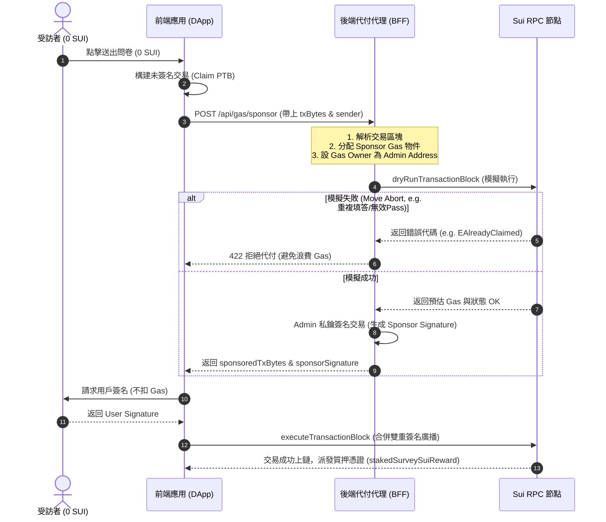

# Sponsored Transactions Architecture & Decision Log

## 1. 官方代付技術與第三方選型分析

在 Sui 區塊鏈中，Sponsor 代付交易（Sponsored Transactions）是一項原生且極為強大的特性。為了解決受訪者錢包餘額為 0 SUI 也能順暢提交問卷的痛點，我們評估了以下三種代付技術方案：

| 評估維度       | 方案 A：Sui 官方 SDK 原生代付 (推薦)                                     | 方案 B：Mysten Enoki Gas Pool                    | 方案 C：Shinami Gas Station                          |
| :------------- | :----------------------------------------------------------------------- | :----------------------------------------------- | :--------------------------------------------------- |
| **主導開發方** | Mysten Labs (官方 SDK `@mysten/sui`)                                     | Mysten Labs                                      | Shinami (第三方)                                     |
| **技術架構**   | 極簡無狀態架構。後端使用官方 SDK 載入代付私鑰即可對交易簽名。            | SaaS 平台，需與 Enoki zkLogin 靜默錢包高度綁定。 | 第三方 SaaS 平台，具備預算分析與 Dashboard。         |
| **CORS 限制**  | 後端接口完全自主控制，無 CORS 問題。                                     | 前端直接集成時受限於 API Key 安全曝光風險。      | 不支援 CORS，必須由後端代理轉發。                    |
| **測試方便性** | **極高**。支援本地離線 Test Scenario 與 Devnet 測試，無需任何 API 金鑰。 | 較低，需於開發者後台配置多種帳戶與證書。         | 較低，需開通第三方帳戶並為 Devnet/Testnet 充值 SUI。 |
| **計費方式**   | 完全依據鏈上真實 Gas 消耗（由代付錢包支付）。                            | 支援法幣 (Fiat-only) 支付或 SUI 扣款。           | 依據 Gas 消耗量 + Shinami 服務手續費。               |

---

## 2. 最終架構決策 (Hybrid Architecture)

為保證 MVP 的**零摩擦開發與 100% 離線測試綠燈**，同時兼顧生產環境的**高可用性與預算控管**，我們決定採用 **「官方原生代付代理 + 第三方服務 Fallback」** 的混合架構：

1. **核心技術 (優先使用官方工具)**：
   後端 Fastify 伺服器建立一個 `/api/gas/sponsor` 接口。該接口直接使用 `@mysten/sui` 的原生 `Transaction` 代付屬性：

   ```typescript
   tx.setSender(senderAddress)
   tx.setGasOwner(sponsorAddress)
   // 由後端動態分配 sponsor 擁有的 Gas Coin 物件與預算
   tx.setGasPayment(gasCoins)
   tx.setGasBudget(gasBudget)
   ```

   代付人在本地即為 `SUI_ADMIN` (管理員帳號)。此方案 100% 使用官方原生工具，不引入任何額外外部依賴，測試穩定度最高。

2. **第三方 Fallback (Shinami Gas Station)**：
   當後端檢測到環境變數中配置了 `SHINAMI_GAS_STATION_KEY` 時，代付簽名將會轉發（Proxy）至 Shinami JSON-RPC 接口進行處理。這能在主網部署時獲得 Shinami 的多帳號預算控管與防止重放攻擊防禦。

3. **安全模擬攔截 (Dry Run)**：
   不論使用何種代付方式，後端在正式簽名代付前，**必須**先調用官方 RPC `suiClient.dryRunTransactionBlock`。
   若模擬結果中出現任何 Move Abort（例如通行證無效、重複填答、金庫已滿），後端將**直接拒絕簽名**。此舉可 100% 避免因前端惡意提交無效交易而浪費代付人（專案方）的 Gas。

---

## 3. 代付交易全鏈路流程


