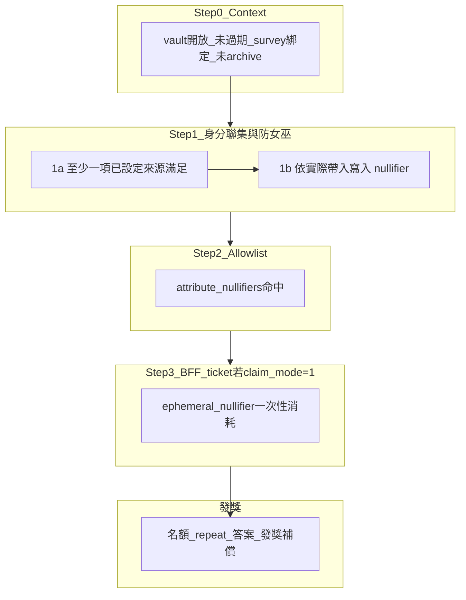

# ADR: Unified Claim 與領獎檢查流程

> Status: **Accepted**（2026-06-09）  
> Context: CertiK Scan_1 R0 — 單一鏈上入口與領獎檢查流程規格  
> 關聯：Pass 憑證與 nullifier 細節見 [PassLifecycle.md](PassLifecycle.md)；vault 生命週期見 [SurveyLifecycle.md](SurveyLifecycle.md)；補償金流見 [GasSponsorship.md](GasSponsorship.md)

## Context

所有獎勵領取經 **單一**鏈上函式 `survey_vault::claim`。本 ADR 定義 **領獎前須通過的檢查流程**（Step 0～3），以及資格通過後的 **發獎** 行為。

舊公開入口 `claim_v2`、`claim_with_ticket`、`claim_with_nft_marking` 廢棄，不再作為領獎路徑。

問卷註冊須經 `survey_vault::register_survey`，僅 vault creator 可將 Survey 綁定至該 vault。**Vault 與 Survey 永遠 1:1**（`SurveyVault.survey_registered`、`SurveyRegistry.registered_vaults`）。Registry 採 `prepare_survey`（零 table 寫入）+ `commit_survey`（驗證通過後原子寫入），避免驗證失敗時佔用 `content_hash`。

---

## 名詞

| 名詞 | 說明 |
|------|------|
| **Credential（憑證槽）** | `SurveyPass` 上某一驗證來源的有效紀錄（Email、Google、World ID 等），含 `source`、nullifier、過期時間 |
| **驗證來源 `allowed_sources`** | 問卷建立時勾選、接受的 BFF 簽發 credential 類型（`survey.allowed_sources`） |
| **已啟用來源集合** | `survey.allowed_sources` ∪（`vault.allowed_nft_type` 有值時之 NFT 類型）；Step 1a 聯集門檻的依據 |
| **外部來源（NFT）** | 已啟用來源集合中的一類；**非** BFF 簽發、**不**寫入 `CredentialSlot`；鏈上以 NFT 物件所有權與類型驗證 |
| **Pass nullifier** | BFF 依身分驗證衍生的雜湊，存於 Pass credential 槽；用於 **防女巫**（同一身分不可換錢包重複領同一 vault） |
| **NFT object nullifier** | `SHA256(nft_object_id \|\| vault_id)`；同一顆 NFT 對同一 vault **一次性** |
| **Allowlist** | 問卷上的客群 nullifier 清單（`allowed_nullifiers` + `match_threshold`）；現階段預設為空；`attribute_nullifiers` 僅比對命中、不消耗 |
| **Ephemeral ticket nullifier** | BFF 一次性領獎票（`RealTimeTicketPayload`）內的隨機 nullifier；與 Pass / NFT nullifier 不同，用於 **ticket 重放防護** |
| **SurveyPass** | 鏈上 Soulbound 物件，承載多個 credential 槽與其 nullifier |

NFT **不**新增 `survey.allowed_sources` 的 `SRC_*` 常數；類型門檻由 `vault.allowed_nft_type` 單獨配置。

詳見 [PassLifecycle.md](PassLifecycle.md)（設計過程紀錄：[History/專案 SurveyPass 方案](../History/專案%20SurveyPass%20方案.md)）。

---

## 檢查流程總覽

Step 1～3 為 **AND**：全部適用的檢查都須通過，才進入發獎。



---

## Step 0：共通前置（Context）

每一筆 `claim` 須先確認：

- `vault.status` 為開放（未 close）
- 當前時間未過 `vault.deadline_ms`
- `survey.vault_id` 與目標 vault 一致
- `survey.status` 非 archived

---

## Step 1：身分資格與防女巫（Pass credential ∪ 外部 NFT）

包含 **兩部分**（同一 Step，皆須通過）：

### 1a 驗證來源（聯集）

發起人設定的 **已啟用來源集合**：

- **BFF 來源**：`survey.allowed_sources` 所列 credential 類型（Email、World ID 等）
- **外部來源**：`vault.allowed_nft_type = Some(type)` 時，NFT 類型 `type`

**通過條件**：已啟用來源中 **至少一項** 被本次 claim 實際滿足：

| 來源 | 滿足條件 |
|------|----------|
| BFF 來源 | PTB 帶入 `SurveyPass`，且 `allowed_sources` 中至少一種 credential 仍有效（未過期、未 revoke、`credential_digest` 與 slot `commitment` 一致） |
| 外部 NFT | PTB 帶入 NFT 物件，類型與 `allowed_nft_type` 匹配，且 `ctx.sender()` 為 owner |

- 發起人可 **僅設 NFT**（`allowed_sources` 為空、`allowed_nft_type` 有值）——僅 NFT 可滿足 1a
- 發起人可 **僅設 BFF 來源**（`allowed_nft_type` 未設定）——僅 Pass credential 可滿足 1a
- 兩者皆設時，**不要求** 同時持有；**至少一項** 即可通過 1a

**範例**（World ID + NFT + allowlist 皆啟用）——以下三種皆可通過 Step 1（並須通過 Step 2）：

| 情境 | 持有 | PTB 帶入 |
|------|------|----------|
| 1 | World ID | `SurveyPass` |
| 2 | NFT | NFT 物件（無 `SurveyPass`） |
| 3 | World ID + NFT | `SurveyPass` + NFT 物件 |

### 1b Nullifier 防女巫（累加寫入）

依 **PTB 實際帶入且通過驗證** 的來源，**分別**寫入 `vault.used_nullifiers`（同一筆 claim 可寫入多組）：

| 帶入 | 寫入內容 | 規則 |
|------|----------|------|
| `SurveyPass` 且 BFF 來源命中 | 各 `CREDENTIAL_ACTIVE`（未 revoke）槽，**含已過期** | `SHA256(pass_nullifier \|\| vault_id)`；他人已用 → 拒絕；同 sender 且問卷允許 repeat → 可重用 |
| NFT 物件且類型匹配 | 該 object id | `SHA256(nft_object_id \|\| vault_id)`；已存在 → `EDuplicateNullifier` |

- 僅帶 `SurveyPass` → 只寫 Pass 槽 nullifier（情境 1）
- 僅帶 NFT → 只寫 NFT object nullifier（情境 2）；**不需** `SurveyPass`
- 兩者皆帶且皆有效 → **兩者都寫**（情境 3）：Pass **所有未 revoke 槽** + NFT object-id
- **不**強制擇一；**不**強制「有 Pass 就不寫 NFT」
- `vault.allowed_nft_type = None` 時，不可僅靠 NFT 滿足 1a；若 PTB 仍帶 NFT → 拒絕

過期 Pass nullifier 亦須寫入；否則使用者可先填再 `update_pass_credential` 刷新憑證，使舊 nullifier 脫離寫入範圍而繞過防女巫。

**Auth 階段（鑄 Pass）**：全域 `NullifierRegistry` 防止同一 nullifier 綁到 **不同 owner** 的 Pass。

**Repeat 填答**：Pass nullifier 可依 repeat 設定由同 sender 重用；NFT object-id 對每 vault **一次性**——repeat 須換未使用過的 NFT，或本次僅帶 Pass。

**Ticket 問卷（`claim_mode = 1`）仍須通過 Step 1**，與 Step 3 為 AND，不可僅憑 ticket 跳過身分資格檢查。

---

## Step 2：Allowlist（客群）

| 條件 | 結果 |
|------|------|
| `allowed_nullifiers` 為空 | 通過（現階段預設） |
| 非空 | 提交的 `attribute_nullifiers` 命中數 ≥ `match_threshold` |

`attribute_nullifiers` 為 claim 交易輸入，只用於與 allowlist 比對命中。**不**寫入 `vault.used_nullifiers`；同一客群 hash 可被多位填答者使用。同一身分重複領獎由 Step 1b 處理。

不論 Step 1 以 Pass、NFT 或兩者滿足 1a，allowlist 非空時 **皆須** 命中；NFT **不能** 替代 allowlist。

與 Step 1 為 **AND**。

---

## Step 3：BFF 一次性 Ticket

| `survey.claim_mode` | 結果 |
|---------------------|------|
| `0`（PASS_AUDIENCE） | 跳過 |
| `1`（ONE_TIME_TICKET） | 須有效 BFF 簽名之 `RealTimeTicketPayload`，且 `ephemeral_nullifier` 於鏈上 **一次性消耗** |

### Ticket payload（BCS `RealTimeTicketPayload`）

```
vault_id: ID
survey_id: ID
claimant: address
ephemeral_nullifier: vector<u8>
expires_at: u64
```

`claim_mode = 1` 時，PTB 依 Step 1 實際滿足 1a 的來源帶入對應物件：

- 僅 Pass：`SurveyPass` + ticket 欄位
- 僅 NFT：NFT 物件 + ticket 欄位（無 `SurveyPass`）
- 兩者：`SurveyPass` + NFT + ticket 欄位

---

## 發獎（資格通過後）

與 Step 1～3 **分開**：處理名額、重複填答次數、答案與獎勵，**不是**防女巫的主機制。

- **同錢包次數**：`claim_counts[sender]`；首次發 `per_response`，repeat 模式下发 `repeat_reward`，受 `repeat_max_times` 限制
- **總名額**：`claimed_count` 不得超過 `max_responses`
- **答案**：inline 或 blob；blob id 不可重複（上限與分流規則見 [StorageStrategy.md](StorageStrategy.md)）
- **補償**：符合條件時從 `vault.gas_balance` 支付 sponsor gas / storage 補償（分流三情境見 [GasSponsorship.md](GasSponsorship.md)）

前端以鏈上事件估算「已填次數」僅供 UX，**權威判定以鏈上 `claim` 為準**。

---

## Submit 時序

### 生命週期較早（Auth 頁）

```
外部驗證（Email / OAuth / World ID）
  → BFF 簽 Pass ticket（含 nullifier）
  → 鏈上 mint_pass / update_pass_credential
  → SurveyPass 具備 Step 1 所需 BFF credential（若發起人有勾選）
```

NFT 不需 Auth 頁鑄 Pass；填答當下以錢包持有之 NFT 物件驗證。

### 按「送出問卷」當下

**Pass 問卷（`claim_mode = 0`）**

```
組 claim PTB（auth_kind = 0；依 1a 帶 SurveyPass 和/或 NFT）
  → gas sponsor / 錢包簽名
  → 鏈上 claim：Step 0～2（Step 3 跳過）→ 發獎
```

**Ticket 問卷（`claim_mode = 1`）**

```
POST /api/ticket/issue（BFF 簽一次性票；發票前應已具備 Step 1 聯集資格）
  → 組 claim PTB（auth_kind = 1；依 1a 帶 Pass/NFT + ticket 欄位）
  → gas sponsor / 錢包簽名
  → 鏈上 claim：Step 0～3 → 發獎
```

Ticket 一定在 claim 交易 **之前** 向 BFF 取得；鏈上於 **同一筆** `claim` 交易內驗證 ticket 簽名與 Step 1 身分資格。

---

## 鏈上 / BFF / 前端分工

| 步驟 | 鏈上 | BFF | 前端 |
|------|------|-----|------|
| Step 0 Context | 必驗 | — | 可預覽 vault / survey 狀態 |
| Step 1a 驗證來源（聯集） | 必驗 | 鑄 Pass 時簽 ticket；ticket issue 可預檢 Pass 或 NFT | Auth 頁、送出前預檢 |
| Step 1b nullifier（累加） | 必驗 | 鑄 Pass 時登記 `NullifierRegistry` | 可同筆帶 Pass + 所選 NFT |
| Step 2 Allowlist | 必驗（非空時） | — | 可預覽 |
| Step 3 Ticket | 必驗（`claim_mode=1`） | `/api/ticket/issue` 簽票 | 送出前申請 ticket |
| 發獎 | 必驗 | gas sponsor dry-run | 事件計數僅 UX |

---

## Decision：`auth_kind` 與單一入口

| `auth_kind` | 名稱 | 須符合 `claim_mode` | PTB 可帶（至少一項滿足 Step 1a） |
|-------------|------|---------------------|----------------------------------|
| `0` | PASS | `0`（PASS_AUDIENCE） | `SurveyPass`（可選）、NFT（可選）；ticket 欄位為空 |
| `1` | TICKET | `1`（ONE_TIME_TICKET） | 同上 + `IssuerConfig` + ticket 簽名欄位 |

NFT 資格檢查併入 **Step 1**（外部來源），隨 unified `claim` 一併執行（非獨立廢棄入口）。NFT **不是**第三種 `auth_kind`；與 Pass 為同一步驟內的可選組合參數。

BFF gas 白名單僅允許 `survey_vault::claim`（及 Pass 鑄造相關 `survey_pass` 函式）。

## 變更紀錄

| 日期 | 說明 |
|------|------|
| 2026-06-08 | 初版：單一 `claim` 入口、`auth_kind` 分派 |
| 2026-06-09 | 重寫：完整 Step 0～4 + 發獎檢查流程；Pass/NFT AND；Step 1 含 nullifier 防女巫；ticket 問卷仍須 Pass |
| 2026-06-09 | Step 1b：未 revoke 槽 nullifier（含已過期）皆寫入 `used_nullifiers`；說明 refresh 繞過風險 |
| 2026-06-09 | Step 2：明確 `attribute_nullifiers` 僅比對命中、不消耗，與 V5 受眾規格一致 |
| 2026-06-09 | Step 3 NFT 併入 Step 1；Pass/NFT 改為**聯集**資格（至少一項）；nullifier **累加**寫入；同時持有時 Pass 全槽 + NFT object-id；原 Step 4 Ticket 改編為 Step 3；刪除 Pass AND NFT 舊敘述 |
| 2026-06-09 | 規格確認，狀態 Accepted |
| 2026-06-11 | 補 system_design 交叉連結（PassLifecycle / SurveyLifecycle / GasSponsorship / StorageStrategy）；內容不變 |
