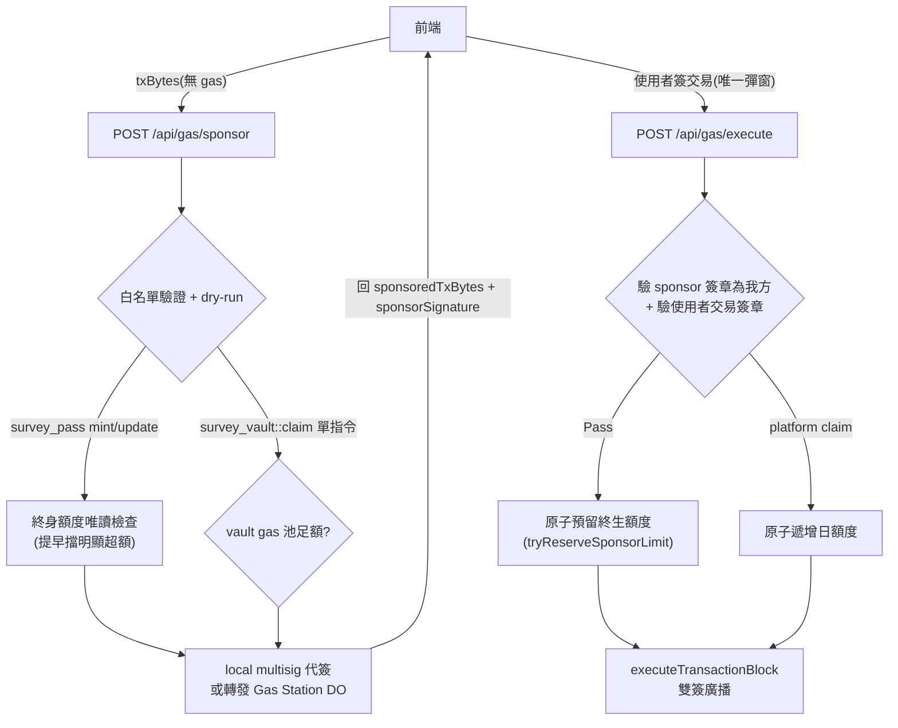

# Gas 代付與補償（Gas Sponsorship）

> Status: **Implemented**（2026-06-11，依當前程式碼撰寫）
> 來源：[`bff/src/gas/`](../../bff/src/gas/)、[`packages/gas-station-core/`](../../packages/gas-station-core/src/)、[`survey_vault.move`](../../contracts/sources/survey_vault.move)
> 金鑰分層與輪換見 [安全指引](../安全指引.md)；託管拓樸見 [託管架構](../託管架構.md)

## 摘要

BFF 以 **2-of-3 multisig sponsor** 為使用者代付兩類交易：**Pass 鑄造/更新**（平台終身額度制）與 **問卷 claim**（vault gas 池支付補償；池空時轉平台日額度）。所有代付交易經 **MoveCall 白名單 + dry-run** 驗證後才簽名，無資料表記帳——**免費額度即時數鏈上歷史**。

**單簽授權模型**：代付分兩步——`/api/gas/sponsor` 只做白名單驗證 + dry-run + 代簽（不消耗額度、不需前置授權簽章），`/api/gas/execute` 驗證**使用者的交易簽章**（即代付同意憑證）後才原子預留額度並廣播。使用者全程只簽**一次**（交易本身）。額度狙擊（冒用他人地址消耗終生額度）由「execute 需受害者交易簽章、攻擊者偽造不出」杜絕；硬上限由 execute 端的原子預留保證。

---

## 端點

| 端點 | 用途 |
|------|------|
| `GET /api/gas/health` | sponsor 餘額（門檻 `gasBudgetCapMist × 5`）、動態 gas 補償、`local`/`do` 模式、coin 佇列狀態 |
| `GET /api/gas/sponsor-count?address=` | 該錢包已用 / 剩餘 Pass 代付次數 |
| `POST /api/gas/sponsor` | 白名單驗證 + dry-run + 代簽，回 `{sponsoredTxBytes, sponsorSignature}`（body：`txBytes`、`senderAddress`）。不消耗額度、無前置授權簽章 |
| `POST /api/gas/execute` | 驗 sponsor/使用者交易簽章 → 原子消耗額度 → 雙簽廣播，回 `{digest}`（body：`sponsoredTxBytes`、`userSignature`、`sponsorSignature`） |

`/sponsor` 要求 tx sender == `senderAddress`（[`sponsorAuth.ts`](../../bff/src/gas/sponsorAuth.ts) `assertTxSenderMatches`）。`/execute` 驗證兩件事（皆對完整 TransactionData bytes）：① sponsor 簽章須為本服務金鑰所簽（確認 bytes 出自 `/sponsor`，杜絕廣播任意 bytes）；② 使用者交易簽章須由 tx sender 所簽（= 代付同意憑證）。zkLogin 簽章經網路對應 GraphQL endpoint 驗證（env `SUI_GRAPHQL_URL`，預設依 `SUI_NETWORK`）。

---

## MoveCall 白名單（[`sponsorTxValidation.ts`](../../packages/gas-station-core/src/sponsorTxValidation.ts)）

- 只允許 **MoveCall** 指令、package 必須等於部署 `SUI_PACKAGE_ID`。
- `survey_pass` 模組：僅 `mint_pass`、`mint_pass_with_extra_credentials`、`update_pass_credential`。
- `survey_vault` 模組：僅 `claim`，且 **整個 PTB 只能有這一條指令**。
- Pass 類與 claim **不可混在同一筆**；其他模組一律拒絕。
- 代付 mint 的 `deposit_payer` 參數必須 = sponsor 地址（確保 rebate 分流，見 [PassLifecycle.md](PassLifecycle.md)）。
- Pass ticket 在 BFF 端先驗一次 issuer 簽名；extra credentials 上限 `MAX_EXTRA_CREDENTIALS`。
- claim 代付加驗：inline 答案 ≤ `effectiveInlineLimit`（env cap 與 vault 鏈上值取小）、blob_id ≤ 1000 bytes、`encrypted_answers` 與 `answer_blob_id` 不可同時帶。
- 代付 Pass 交易另經 escape clawback 驗證：首張代付 ticket ≥ `ceil(netGas × 110%)`（[PassLifecycle.md](PassLifecycle.md)）。

---

## 額度政策

### Pass 代付（終身額度）

- `passMax` 預設 **2 次／錢包終身**；計數方式由單一 env `SPONSOR_COUNT_SCOPE` 決定（[`sponsorPolicy.ts`](../../bff/src/gas/sponsorPolicy.ts)）：

| 值 | 語意 |
|----|------|
| 未設 / 空 | 只數當前 `SUI_PACKAGE_ID` 的代付交易（**安全預設**） |
| `all` | 不過濾 package 與時間（舊行為） |
| epoch ms / ISO 字串 | 當前 package ∧ 該時間之後 |
| `.json` / `file:` 路徑 | 規則檔覆寫 `packageScope` / `sinceMs` / `passMax`；解析失敗一律 fallback 預設、**絕不放寬成 all** |

- 計數實作（[`sponsorLedger.ts`](../../bff/src/gas/sponsorLedger.ts)）：查 sender 最近交易（≤ 5 頁 / 250 筆），數「sponsor 為本平台且命中 `survey_pass` mint/update」者；鏈上查詢結果快取 45 秒。`/api/gas/execute` 在驗過使用者交易簽章後於 SQLite 原子預留（`tryReserveSponsorLimit`，TTL 內防並發超量），廣播失敗回滾；`/api/gas/sponsor` 僅做唯讀檢查（`checkSponsorLimit`）提早擋明顯超額，不預留。

### Claim 代付（vault → platform 兩層）

驗證時讀取 vault：`gas_balance ≥ gas_compensation_amount` → **vault-sponsored**（補償在鏈上回流 sponsor，見下節）；不足 → **platform-sponsored**：

- 日額度 `PLATFORM_SPONSOR_DAILY_LIMIT`（預設 **3 次／錢包／UTC 日**，SQLite 記帳）。
- Tier 門檻 `MIN_PLATFORM_SPONSOR_TIER`（預設 0；設 1 時須持有 Social / World ID 槽，見 [PassLifecycle.md](PassLifecycle.md)）。
- 單筆 gas 上限 `MAX_PLATFORM_CLAIM_GAS_MIST`（預設 30_000_000）。

---

## 防濫用

| 機制 | 預設 | 來源 |
|------|------|------|
| 端點 rate limit | `GAS_SPONSOR_RATE_LIMIT_MAX = 2` / `…WINDOW_MS = 60_000`（/sponsor 與 /execute 各自套用） | [`gasConfig.ts`](../../packages/gas-station-core/src/gasConfig.ts) |
| 每錢包 rate limit | `…MAX_PER_WALLET = 5` / `…WALLET_WINDOW_MS = 60_000`（SQLite，套在 /sponsor 的 dry-run 重操作） | [`sqliteWalletRateLimitStore.ts`](../../bff/src/gas/stores/sqliteWalletRateLimitStore.ts) |
| 同意憑證 | /execute 驗使用者交易簽章（額度狙擊防線）＋ sponsor 簽章須我方所簽（不廣播任意 bytes） | `sponsorAuth.ts` |
| 註銷 mint guard | `REVOCATION_MINT_GUARD_ENABLED`；mint ticket 申請 rate limit `REVOCATION_MINT_TICKET_RATE_LIMIT_HOURS`（預設 1h） | [`revocation.ts`](../../bff/src/security/revocation.ts) |
| dry-run | 失敗即拒簽（亦擋鏈上必敗交易） | [`sponsorPipeline.ts`](../../packages/gas-station-core/src/sponsorPipeline.ts) |

---

## 鏈上補償金流（`survey_vault::claim` 內，[`survey_vault.move`](../../contracts/sources/survey_vault.move) `process_claim_and_payout`）

| 情境 | gas 補償（`gas_compensation_amount`） | 儲存補償（`storage_compensation_amount`） |
|------|--------------------------------------|--------------------------------------------|
| 代付且 tx sponsor == `vault.sponsor_address` | → sponsor（池足額才付） | blob 答卷且池足額 → **併入同一筆轉給 sponsor** |
| 自付（無 sponsor）＋ blob 答卷 | 不付 | → respondent（補貼其自付的 Walrus/儲存成本） |
| 自付＋ inline 答卷 | 不付 | 不付 |

- `vault.sponsor_address` 由 creator 設定（預設為建立時參數）；補償下限 `ProtocolConfig.min_gas_compensation_mist`（`EGasCompTooLow`）。
- BFF 對 vault-sponsored claim 動態估補償展示值：取最近 10 筆 `claim` 成功交易的 netGas（修剪最大值後取 peak），上限 `min × 3`，快取 60 秒（[`handler.ts`](../../bff/src/gas/handler.ts) `calculateDynamicGasCompensation`）。
- `BFF gas config 不變量`（啟動斷言）：`maxPlatformClaimGas ≤ gasBudgetCap ≤ minGasCompensation`、`buffer < cap`。

---

## 簽名與營運

- **金鑰**：`GAS_SPONSOR_PRIV_1/2` + 冷存 `GAS_SPONSOR_PUBKEY_3` 組 2-of-3 multisig（[`sponsorSigner.ts`](../../bff/src/gas/sponsorSigner.ts)；產生腳本 `scripts/src/setup-multisig-sponsor.ts`）。分層原則見 [安全指引](../安全指引.md)。
- **模式**：`GAS_STATION_MODE=local`（BFF 內簽）或 `do`（轉發 Cloudflare Durable Object，`GAS_STATION_URL` + `GAS_STATION_SHARED_SECRET`，HMAC 驗證）。
- **Coin 佇列**：sponsor coin 上鎖輪用（lock TTL 30s、重試 3 次、庫存 5s 刷新）。
- **Coin merge task**（[`coinMergeTask.ts`](../../bff/src/gas/coinMergeTask.ts)）：碎片 coin（< `COIN_MERGE_THRESHOLD_SUI`，預設 0.1 SUI）數量 ≥ `COIN_MERGE_TRIGGER_COUNT`（預設 50）時合併；間隔 `COIN_MERGE_INTERVAL_MS`（預設 1h）。
- close / purge 背景任務同樣以 sponsor signer 送出（見 [SurveyLifecycle.md](SurveyLifecycle.md)）。

## 變更紀錄

| 日期 | 說明 |
|------|------|
| 2026-06-11 | 初版：自 `bff/src/gas/`、`packages/gas-station-core/` 現狀萃取，整合鏈上補償分流與 SPONSOR_COUNT_SCOPE 語意 |
| 2026-06-11 | 改單簽授權模型：拆出 `/api/gas/execute`，額度預留/日額度遞增移至「驗過使用者交易簽章之後」，移除前置 personal-message 授權簽章（使用者由 2 簽降為 1 簽，仍杜絕額度狙擊） |
