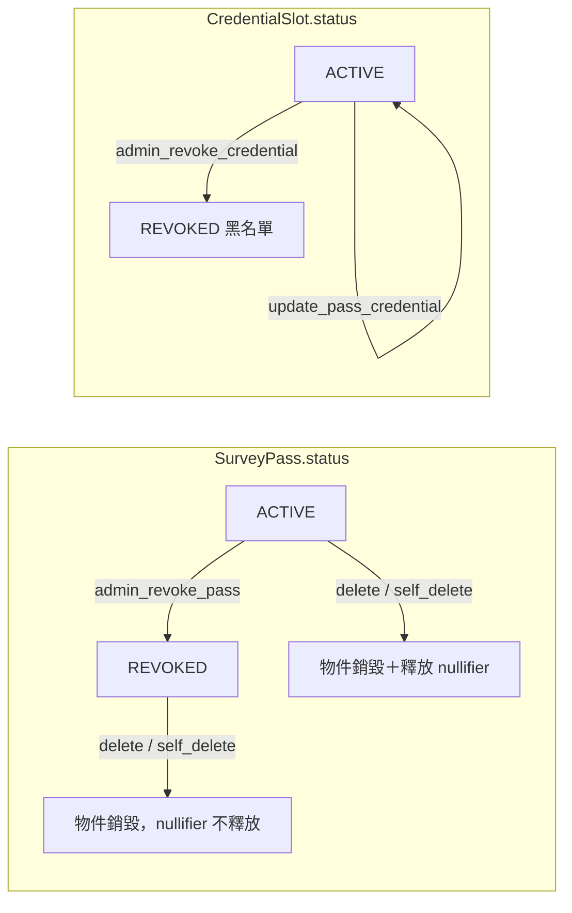

# SurveyPass 生命週期（Pass Lifecycle）

> Status: **Implemented**（2026-06-11，依當前程式碼撰寫）
> 來源：[`survey_pass.move`](../../contracts/sources/survey_pass.move)、[`bff/src/auth/ticket.ts`](../../bff/src/auth/ticket.ts)、[`bff/src/pass/handler.ts`](../../bff/src/pass/handler.ts)、[`scripts/src/admin_rescue.ts`](../../scripts/src/admin_rescue.ts)
> 設計過程紀錄：[History/專案 SurveyPass 方案](../History/專案%20SurveyPass%20方案.md)、[History/專案 Pass註銷](../History/專案%20Pass註銷.md)
> Pass 在領獎中的角色見 [ADR_ClaimUnified.md](ADR_ClaimUnified.md)；代付政策見 [GasSponsorship.md](GasSponsorship.md)

## 摘要

**SurveyPass** 是 shared object 形式的 soulbound 身分證明：所有變更入口以 `pass.owner == sender` gating，不可轉讓。每個 owner 在 `NullifierRegistry.passes` 中 **至多一本 Pass**（`EPassAlreadyExists`）。Pass 本體承載多個 **per-source CredentialSlot**（dynamic field），每槽由 BFF 簽發的 ticket 寫入。



---

## 結構與名詞

| 名詞 | 說明 |
|------|------|
| `SurveyPass` | `owner`、`deposit_payer`（出資人，可 ≠ owner）、`credential_sources`、`status`（ACTIVE=0 / REVOKED=3）、`escape_clawback_mist` |
| `CredentialSlot` | per-source dynamic field：`commitment`、`nullifiers[]`、`issued_at`、`expires_at`、`status`（ACTIVE=0 / REVOKED=1）。**無 EXPIRED 狀態**——過期以 `expires_at` 即時判讀 |
| `NullifierRegistry` | 全域 shared：`used: nullifier → owner`（防同一身分綁不同 owner）、`passes: owner → pass_id`（一人一本） |
| `IssuerConfig` | `issuer_pubkey`（BFF ticket 驗簽公鑰，admin 可輪換 `set_issuer_pubkey`）、`admin` |
| `commitment` | `blake2b256(BCS(CredentialDigestPayload{owner, source, nullifiers, expires_at}))`——槽內容防竄改錨；`is_valid` / `is_source_valid` 都重算比對 |
| sentinel Pass | `init` 時 share 一本 `status=REVOKED、owner=@0x0` 的空 Pass，供 `use_pass=false` 的 claim PTB 填位（搭配 [`claim_sentinel::VoidNft`](../../contracts/sources/claim_sentinel.move)） |

**驗證來源常數**（`SRC_*`）：

| 值 | 來源 | BFF 預設 credential TTL |
|----|------|--------------------------|
| 1 | SELF_REPORT | 7 天（fallback） |
| 2 | EMAIL | 90 天 |
| 3 / 6 / 7 | SOCIAL / GOOGLE / GITHUB | 90 天 |
| 4 | SELF_PROTOCOL | 7 天（fallback） |
| 5 | WORLD_ID | 365 天 |
| 8 | ATTRIBUTES | 客群屬性槽（見 [V5_自我揭露](../V5_自我揭露.md)） |

TTL 可由 `BFF_PASS_TTL_MS_EMAIL` / `_SOCIAL` / `_WORLDID`、全域 `BFF_PASS_TTL_MS` 覆寫（[`ticket.ts`](../../bff/src/auth/ticket.ts)）。

**Tier**（BFF 層概念，非鏈上欄位）：[`platformSponsorEligibility.ts`](../../bff/src/gas/platformSponsorEligibility.ts) 將來源 `{3, 5, 6, 7}`（Social / World ID）視為 **Tier 1**，其餘 Tier 0；用於平台代付資格門檻 `MIN_PLATFORM_SPONSOR_TIER`。

---

## 鑄造與更新

```
外部驗證（Email OTP / OAuth / World ID） → BFF 簽 TicketPayload（ed25519）
  → 鏈上 mint_pass / mint_pass_with_extra_credentials / update_pass_credential
```

`TicketPayload = {owner, source, nullifiers, commitment, expires_at, escape_clawback_mist}`，由 `IssuerConfig.issuer_pubkey` 驗簽（`EInvalidTicketSig`）、過期拒收（`ETicketExpired`）、nullifier 非空（`EEmptyNullifier`）。

| 函式 | gating | 行為 |
|------|--------|------|
| `mint_pass` | `sender == owner`；owner 無既有 Pass | 登記 nullifier → 建 Pass → 寫入第一個槽 → share |
| `mint_pass_with_extra_credentials` | 同上 | 一次鑄多來源；extra 各自驗票；來源不可重複（`EDuplicateSource`）；extra ticket 的 `escape_clawback_mist` 固定 0 |
| `update_pass_credential` | `sender == owner`；Pass ACTIVE | 既有槽刷新（**REVOKED 槽不可刷**，`ECredentialRevoked`）或新增來源槽；nullifier 一律重新登記 |

**Nullifier 雙層防護**：

1. **issuance nullifier**（`NullifierRegistry.used`）：mint/update 時登記；同一 nullifier 已綁 **其他 owner** → `EDuplicateNullifier`（同 owner 重綁允許，支援刷新）。
2. **credential_digest**（slot `commitment`）：防止鏈上資料被竄改後仍判有效。

**有效性判讀**：

- `is_source_valid(pass, source, clock)`：Pass ACTIVE ∧ 槽 ACTIVE ∧ 未過期 ∧ nullifiers 非空 ∧ commitment 相符。
- `is_valid(pass, clock)`：任一來源槽滿足上述即 true（即 `effective` 資格 = 各 active 槽之聯集）。

---

## Escape Clawback（代付 Pass 的返還保證金）

問題：刪除 Pass 的 storage rebate 歸 **交易 gas owner**、鏈上不可改道；若項目方代付鑄造而使用者可自由自刪，rebate 會被女巫抽乾。對策是 **deposit_payer 分流 + clawback 保證金**：

| 情境 | 規則（鏈上） |
|------|--------------|
| 自付 mint/update（`deposit_payer == owner`） | `escape_clawback_mist` 必須 = 0（`EInvalidEscapeClawback`） |
| 代付 mint（`deposit_payer != owner`） | ticket 內 `escape_clawback_mist` 必須 > 0，寫入 Pass |
| 代付 update | 必須 > 0，**累加** 到 `pass.escape_clawback_mist` |

BFF 端（[`passEscapeClawbackValidation.ts`](../../packages/gas-station-core/src/passEscapeClawbackValidation.ts)）在代簽前 dry-run 驗證：代付 mint/update 的首張 ticket `escape_clawback_mist ≥ ceil(netGas × 110%)`（`ESCAPE_CLAWBACK_BPS = 11_000`）；且代付 mint 的 `deposit_payer` 必須等於 sponsor 地址。

---

## 註銷（三層防線，黑名單語意）

| 層 | 入口 | 效果 |
|----|------|------|
| 鏈上整本 | `admin_revoke_pass`（`IssuerConfig.admin`） | `pass.status = REVOKED`；所有 claim / update 失效；**之後刪除不釋放 nullifier** |
| 鏈上單槽 | `admin_revoke_credential(source)` | 槽 `status = REVOKED`；其他來源照常；該槽 **不可再 update**；nullifier **不釋放** |
| 鏈下 mint guard | BFF 已註銷庫（[`revocation.ts`](../../bff/src/security/revocation.ts)、`REVOCATION_MINT_GUARD_ENABLED=true`） | 簽發 ticket 前查庫，阻擋已註銷 nullifier 重新 mint；`/api/admin/revocation/*`（`ADMIN_SECRET`）維護 |

**「不釋放 nullifier」是刻意設計**（CertiK F53 / CodeReview S2 定性 By Design）：註銷針對「驗證來源帳戶遭駭」場景，該身分對此來源永久失效，駭客不能換地址重綁。**錢包遺失** 的復原不走 revoke：應 `delete_pass`（憑證仍 ACTIVE 時會釋放 nullifier），再到新地址重新 mint 綁回同一身分。一鍵救援腳本 [`admin_rescue.ts`](../../scripts/src/admin_rescue.ts)（`pnpm admin:rescue`）同步執行鏈上 revoke 與 BFF 庫登記。

---

## 刪除（rebate 防抽乾分流）

| 入口 | gating | 費用 | rebate 流向 |
|------|--------|------|--------------|
| `delete_pass` | `sender == deposit_payer` | 無 | gas owner（= deposit_payer 自己） |
| `self_delete_sponsored_pass` | 代付 Pass（`deposit_payer != owner`）且 `sender == owner` | `fee ≥ required_self_delete_fee`，付給 `deposit_payer`，溢繳退回 | gas owner（owner 自付 gas，逃生門） |
| BFF 代刪 `/api/pass/delete` | owner 以 personal-message 簽名授權（`surveysui:delete-pass:{passId}:{ts}`，5 分鐘 TTL） | 使用者免 gas | sponsor 為 gas owner → rebate 回到項目方 |

```
required_self_delete_fee = max(REBATE_FEE_FLOOR × (1 + credential_sources 數), pass.escape_clawback_mist)
REBATE_FEE_FLOOR = 10_000_000 MIST = 0.01 SUI
```

`do_delete` 行為：自 `registry.passes` 移除登記；逐槽移除 dynamic field——**僅當 Pass ACTIVE 且槽 ACTIVE** 才釋放 `registry.used` 中屬於該 owner 的 nullifier（REVOKED 一律保留＝黑名單持續生效）；最後銷毀物件。

---

## 變更紀錄

| 日期 | 說明 |
|------|------|
| 2026-06-11 | 初版：自 `survey_pass.move`、BFF pass/auth 模組現狀萃取；取代 History/專案 SurveyPass 方案.md 與 History/專案 Pass註銷.md 之規格地位 |
