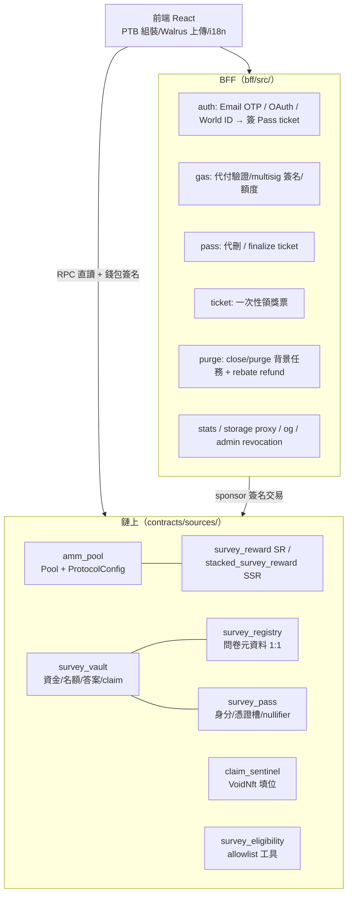

# system_design — 系統行為規格（單一來源）

> 本目錄是 SurveySui **現行系統行為** 的單一來源（single source of truth）。
> 未來的修正、審計回覆與 code review，行為認定一律以本目錄為準；
> `docs/History/` 是設計過程紀錄，**不得作為現行規格引用**（TokenEconomics 漂移事件的教訓：規格無單一來源時，實作偏差會被誤認為規格）。

## 文件索引

| 文件 | 範圍 | Status |
|------|------|--------|
| [SurveyLifecycle.md](SurveyLifecycle.md) | 問卷/Vault 生命週期：建立鏈、close、purge、BFF 自動化、rebate refund | Implemented |
| [ADR_ClaimUnified.md](ADR_ClaimUnified.md) | 領獎檢查流程 Step 0–3、單一 `claim` 入口、`auth_kind` | Accepted |
| [PassLifecycle.md](PassLifecycle.md) | SurveyPass：鑄造/更新、nullifier、註銷三層防線、刪除與 escape clawback | Implemented |
| [GasSponsorship.md](GasSponsorship.md) | gas 代付：白名單、額度（`SPONSOR_COUNT_SCOPE`）、補償金流、multisig 營運 | Implemented |
| [StorageStrategy.md](StorageStrategy.md) | 混合儲存：inline/Walrus 分流、上限、儲存補償與 rebate 關係 | Implemented |
| [TokenEconomics.md](TokenEconomics.md) | SR/SSR reserve-ratio 池、定價、admin 貨幣政策 | Implemented |

### 本目錄之外的現行規格

| 文件 | 範圍 |
|------|------|
| [V5_自我揭露](../V5_自我揭露.md) | 兩階段受眾篩選（Stage1 自填 → Stage2 allowlist 比對） |
| [安全指引](../安全指引.md) | 金鑰/秘密四層分層、輪換 Runbook、上線檢查清單 |
| [託管架構](../託管架構.md) | CF Pages / Worker / D1 部署拓樸 |
| [Reset_SOP](../Reset/Reset_SOP.md) | devnet reset 重部署流程 |

---

## 系統架構總覽

| 分層 | 職責邊界 |
|------|----------|
| 鏈上 | 一切資格與資金的 **權威判定**（claim 檢查、nullifier、額度、補償）；BFF/前端的檢查只是預檢與省 gas |
| BFF | 簽發（Pass ticket、領獎 ticket）、代付、無排程器之自動化（close/purge）、聚合與代理 |
| 前端 | PTB 組裝、加密/解密、儲存分流、UX 預檢（事件計數僅供顯示） |

管理腳本（`scripts/src/`）：`init.ts`（部署初始化）、`admin-pool.ts`（貨幣政策操作）、`admin_rescue.ts`（註銷救援）、`setup-multisig-sponsor.ts`、`reset-registry.ts` 等。

---

## 文件約定

- **標頭**：每份文件以 `> Status: …（日期）` 開頭；值取 `Draft` / `Accepted`（決策定案）/ `Implemented`（已對齊程式碼）/ `Partially Implemented`（標注缺口）。
- **事實來源**：行為敘述以 **程式碼現狀** 為準並附檔案連結；與程式碼不一致處標 TBD 或漂移，不留模糊敘述。
- **變更紀錄**：文末維護日期＋一句話的變更表。
- **去重**：同一機制只在一份文件詳述，其他文件以連結引用（例：補償金流詳述於 GasSponsorship，SurveyLifecycle 僅引用）。
- CertiK finding 的定性結論（By Design / Mitigated）寫入對應規格文件，回覆草稿從文件複製。

## 變更紀錄

| 日期 | 說明 |
|------|------|
| 2026-06-11 | 建立索引；新增 SurveyLifecycle / PassLifecycle / GasSponsorship / StorageStrategy 四份規格 |
