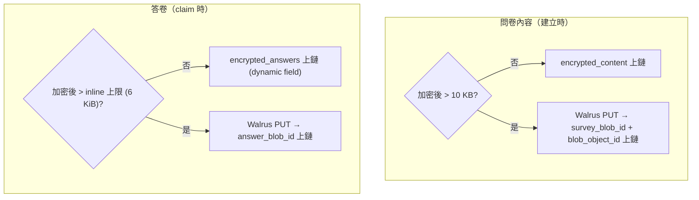

# 混合儲存策略（Storage Strategy）

> Status: **Implemented**（2026-06-11，依當前程式碼撰寫；IPFS fallback 為 mock，見 § 限制）
> 來源：[`survey_vault.move`](../../contracts/sources/survey_vault.move)、[`survey_registry.move`](../../contracts/sources/survey_registry.move)、[`frontend/src/lib/storage.ts`](../../frontend/src/lib/storage.ts)、[`bff/src/storage/`](../../bff/src/storage/)
> 設計過程紀錄：[History/專案 去中心存儲方案](../History/專案%20去中心存儲方案.md)

## 摘要

問卷內容與答卷皆採 **動態分流**：小資料直接上鏈（加密 bytes），大資料走 **Walrus**（blob id 上鏈）。分流門檻的依據是 Walrus 的成本結構——**任何小 blob 編碼後都頂約 63 MiB 計價下限**，小資料上鏈遠比上 Walrus 便宜；大資料則反之（鏈上 object 有實務大小壓力且 storage 計費高）。

---

## 分流規則與上限

### 問卷內容（Survey）

| 層 | 規則 | 來源 |
|----|------|------|
| 前端門檻 | 加密 blob > `VITE_SURVEY_SIZE_THRESHOLD_KB`（預設 **10 KB**）→ 走 Walrus | [`CreatePage.tsx`](../../frontend/src/pages/CreatePage.tsx)、[`FundPage.tsx`](../../frontend/src/pages/FundPage.tsx) |
| 鏈上 | `encrypted_content` 與 `survey_blob_id` **二選一必填**；帶 blob 時必須同時帶 `survey_blob_object_id`（`EMissingBlobObjectId`，供 Walrus 鏈上 extend） | `survey_registry::prepare_survey` |

### 答卷（AnswerRecord）

| 層 | 規則 | 來源 |
|----|------|------|
| 前端門檻 | > `VITE_ANSWER_SIZE_THRESHOLD_KB`（預設 **6**，對齊鏈上 6144 bytes）→ 走 Walrus | [`ptb.ts`](../../frontend/src/lib/ptb.ts)、`vite.config.ts` |
| 鏈上 inline | `encrypted_answers` ≤ `vault.max_inline_answer_bytes`：預設 **6144**、creator 可調範圍 **1024–32768**（`EInlineAnswerTooLarge` / `EMaxInlineOutOfRange`） | `survey_vault.move` |
| 鏈上 blob | `answer_blob_id` ≤ `vault.max_blob_id_bytes`：預設 **256**、範圍 **64–1024**；**全 vault 去重**（`EDuplicateBlobId`，防重放他人答卷 id） | `survey_vault.move` |
| 互斥 | inline 與 blob_id 不可同時帶（BFF 代付驗證 `ambiguous_answer_payload`；鏈上以 inline 優先短路） | [`sponsorTxValidation.ts`](../../packages/gas-station-core/src/sponsorTxValidation.ts) |
| BFF 代付 gate | `effectiveInlineLimit = min(env cap, vault 鏈上值)`；env：`MAX_INLINE_ANSWER_BYTES` / `MAX_INLINE_ANSWER_KB`；blob_id 另設 1000 bytes 硬限 | [`inlineLimit.ts`](../../bff/src/gas/inlineLimit.ts) |

---

## Walrus 上傳 / 下載鏈路（[`storage.ts`](../../frontend/src/lib/storage.ts)）

- **上傳**：前端直接 `PUT {VITE_WALRUS_PUBLISHER_URL}/v1/blobs?epochs=N`；`N = VITE_WALRUS_STORAGE_EPOCHS`（預設 **5**，應覆蓋問卷存活期 + purge 寬限期；Walrus 上限 `max_epochs_ahead = 53`）。回傳 `blobId` 與 `blobObjectId`。失敗時 fallback `POST {BFF}/api/storage/ipfs/upload`。
- **下載**：CID 形（`Qm…`/`bafy…`）走 BFF IPFS proxy；否則直連 Walrus aggregator `/v1/blobs/{id}`，失敗 fallback `GET {BFF}/api/storage/walrus/download/{id}`（CORS / 防火牆備援）。
- **快取**：`POST /api/cache/survey` 可把問卷 blob 預快取到 BFF 本地，降低受訪端讀取延遲（[`cacheManager.ts`](../../bff/src/storage/cacheManager.ts)）。

## 成本錨點

- Walrus 小檔下限：blob 經 erasure coding 後最低以 ~63 MiB 計價 → **小答卷一律走鏈上 inline**，不因「去中心化」而盲目上 Walrus。
- 鏈上 storage 費用在 purge 時以 **storage rebate** 部分回收（見下節），是「小資料上鏈」策略的後段成本回收機制。

---

## 儲存補償與 Storage Rebate 的關係

三個相關但不同的金流（細節分見對應文件）：

| 金流 | 時點 | 方向 | 文件 |
|------|------|------|------|
| `storage_compensation_amount` | claim 當下 | vault gas 池 → sponsor（代付）或 respondent（自付 + blob，補貼其 Walrus 成本） | [GasSponsorship.md](GasSponsorship.md) |
| purge storage rebate | purge 時 | 刪除物件的押金 → **交易 gas owner**（不可改道）；BFF purge task 同 PTB 把盈餘的 50%（`PURGE_REBATE_CREATOR_SHARE_BPS`）轉給 creator | [SurveyLifecycle.md](SurveyLifecycle.md) |
| Pass 刪除 rebate | delete_pass 時 | 同上歸 gas owner；以 `deposit_payer` 分流 + escape clawback 防女巫抽乾 | [PassLifecycle.md](PassLifecycle.md) |

---

## 限制與待辦

- **IPFS fallback 是本地 mock**（[`ipfsProxy.ts`](../../bff/src/storage/ipfsProxy.ts)）：非真正去中心化，僅作 Walrus 不可用時的開發備援。正式環境的容錯策略（重試 Walrus vs 真 IPFS pinning）尚未決策（TBD）。
- Walrus blob **不會在 purge 時刪除**（Walrus 由 epoch 到期自然過期）；`VITE_WALRUS_STORAGE_EPOCHS` 與 `purge_grace_ms` 需在部署時一起調校，避免答卷在寬限期內已不可讀。
- blob 內容的可用性與完整性由 `blob_id` 上鏈背書；鏈上不驗 blob 內容雜湊（信任 Walrus content-addressing）。
- **問卷內容完整性 = 鏈上承諾 + 前端讀取驗證兩段**：發布時前端對完整 markdown 算 `content_hash = sha256(md)` 上鏈（`FundPage`），登記後不可改；作答時 `SurveyPage` 解出內容（inline 解密 / Walrus 下載 / 公開明文皆然）後 **recompute `sha256(markdown)` 與鏈上 `content_hash` 比對**，不符即落入非阻斷的警告頁（使用者可選擇續填或返回）。兩端共用 `crypto.ts::sha256` 杜絕演算法 drift。
- **殘留信任邊界**：前端仍信任使用者選用的 RPC / Walrus aggregator 之**可用性**；上述驗證把「內容被掉包」的攻擊面限縮為「可被前端偵測並警示」，但不防 DoS（節點拒絕服務）。

## 環境變數

| 變數 | 預設 | 消費端 |
|------|------|--------|
| `VITE_SURVEY_SIZE_THRESHOLD_KB` | 10 | 前端問卷分流 |
| `VITE_ANSWER_SIZE_THRESHOLD_KB` / `MAX_INLINE_ANSWER_KB` | 6 | 前端答卷分流（build 時對齊） |
| `MAX_INLINE_ANSWER_BYTES` / `MAX_INLINE_ANSWER_KB` | 6144 | BFF 代付 inline gate |
| `VITE_WALRUS_PUBLISHER_URL` / `VITE_WALRUS_AGGREGATOR_URL` | testnet 公共節點 | 前端上傳/下載 |
| `WALRUS_AGGREGATOR_URL` | — | BFF walrus download proxy |
| `VITE_WALRUS_STORAGE_EPOCHS` | 5 | blob 存活 epoch 數 |

## 變更紀錄

| 日期 | 說明 |
|------|------|
| 2026-06-11 | 初版：自合約/前端/BFF 現狀萃取；更正 History 方案中「Walrus 發布未掛」的過時敘述（前端 `storage.ts` 已實作上傳＋fallback）；取代 History/專案 去中心存儲方案.md 之規格地位 |
