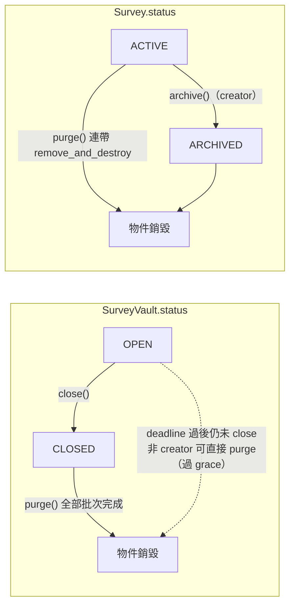

# 問卷與 Vault 生命週期（Survey Lifecycle）

> Status: **Implemented**（2026-06-11，依當前程式碼撰寫）
> 來源：[`survey_vault.move`](../../contracts/sources/survey_vault.move)、[`survey_registry.move`](../../contracts/sources/survey_registry.move)、[`bff/src/purge/`](../../bff/src/purge/)
> 領獎檢查流程見 [ADR_ClaimUnified.md](ADR_ClaimUnified.md)；金流補償見 [GasSponsorship.md](GasSponsorship.md)；答案儲存見 [StorageStrategy.md](StorageStrategy.md)

## 摘要

一份問卷由 **兩個鏈上物件** 組成、**永遠 1:1**：

- **SurveyVault**（`survey_vault.move`）：資金（SSR 獎勵池 + SUI gas 池）、名額、nullifier 表、答案（dynamic field）。
- **Survey**（`survey_registry.move`）：問卷內容/元資料、受眾規則、claim_mode。

生命週期：**建立鏈（owned）→ share → 開放填答 → close → purge（分批）→ 雙物件銷毀**。Sui 無鏈上排程器，close/purge 的「自動觸發」由 BFF 背景任務代發交易，鏈上 gate 重驗。

---

## 狀態機



- `STATUS_OPEN = 0`、`STATUS_CLOSED = 1`（vault）；`STATUS_ACTIVE = 0`、`STATUS_ARCHIVED = 1`（survey）。
- `archive` 不可逆，只擋新 claim（Step 0 檢查 `ESurveyArchived`），不動資金。

---

## 建立鏈（原子 PTB，物件 owned 階段）

```
create_empty → deposit_existing_ssr / invest_and_mint → deposit_gas（可選）
  → merge_balances → split_fee_to_treasury → register_survey → share_vault
```

| 步驟 | 函式 | 檢查 / 效果 |
|------|------|-------------|
| 1 建池 | `create_empty` | `per_response ≥ 1`、`repeat_max_times ≥ 1`、`gas_compensation_amount ≥ config.min_gas_compensation_mist`（`EGasCompTooLow`）；gas coin 須 ≥ 預估總補償（見下）；`fee_paid = false` |
| 2 注 SSR | `deposit_existing_ssr`（或先經 [`invest_and_mint`](TokenEconomics.md) 取得 SSR） | 僅 `fee_paid = false` 時可注入 |
| 2b 補 gas | `deposit_gas` | 僅 `fee_paid = false`；金額 > 0 |
| 3 驗額 | `merge_balances` | 驗 canonical pool；`balance ≥ budget + fee`（`EInsufficientVaultBalance`） |
| 4 繳費 | `split_fee_to_treasury` | creator only；`fee` 轉 `admin_treasury`；置 `fee_paid = true`（之後不可再注資） |
| 5 註冊 | `register_survey` | creator only（F64）；`prepare_survey`（純驗證、零 table 寫入，F63）+ `commit_survey`（原子寫入並 share Survey）；置 `survey_registered = true` |
| 6 共享 | `share_vault` | 須 `fee_paid = true`（`EFeeNotPaid`） |

**gas 池足額公式**（`create_empty`）：

```
per_response_sui = gas_compensation_amount   // storage 補償已廢除
required_gas = max_responses × (repeat_reward > 0 ? 1 + repeat_max_times : 1) × (per_response_sui + ticket_fee)
```

**協議費**（`merge_balances` / `split_fee_to_treasury`，須 canonical pool）：

```
budget = per_response × max_responses + repeat_reward × max_responses × repeat_max_times
fee    = budget × effective_fee_bps / 10_000
effective_fee_bps = total_fee_bps × discount_bps / 10_000   // 預設 2000 × 5000 → 1000 bps = 10%
```

**Survey 註冊驗證**（`survey_registry::prepare_survey`）：

- 題型限 `single_choice` / `multi_choice` / `text` / `scale`；選項 ≤ 50（`MAX_OPTIONS_LIMIT`）；prompt 非空；題目 id 不重複。
- `allowed_sources` 非空；`allowed_nullifiers` ≤ 100（`MAX_ALLOWED_NULLIFIERS`）；`claim_mode ∈ {0, 1}`。
- 內容二選一必填：`encrypted_content`（鏈上）或 `survey_blob_id`（須同時帶 `survey_blob_object_id`，見 [StorageStrategy.md](StorageStrategy.md)）。
- `commit_survey`：`content_hash` 全域去重（`EDuplicateSurvey`）、`vault_id` 唯一（`EVaultAlreadyRegistered`）→ `registry.registered_vaults[vault_id] = survey_id` 即 **1:1 鎖定**。

---

## 填答期（OPEN）

領獎檢查 Step 0–3 與發獎規格見 [ADR_ClaimUnified.md](ADR_ClaimUnified.md)。生命週期視角的關鍵帳目：

- **內容完整性驗證（前端）**：`SurveyPage` 載入時解出問卷 markdown（inline 解密 / Walrus 下載 / 公開明文），**recompute `sha256(markdown)` 與鏈上 `content_hash` 比對**。不符 → 非阻斷的警告頁（精簡說明可能遭竄改或來源異常，提供「繼續填答」與「回到首頁」）。`content_hash` 鏈上不可改（`commit_survey` 後無 setter），故此比對能偵測 RPC / aggregator 對內容的掉包。發布端（`FundPage`）與讀取端共用 `crypto.ts::sha256`。詳見 [StorageStrategy.md](StorageStrategy.md)。
- 每筆 claim 將 `AnswerRecord`（inline payload）寫入 vault dynamic field，`answers_count += 1`。
- 名額：首次 claim 計入 `claimed_count`（≤ `max_responses`）；repeat 計入 `claim_counts[sender]`（≤ `repeat_max_times`，注意鏈上判斷為 `prior <= repeat_max_times`，即同錢包最多 `1 + repeat_max_times` 筆）。
- `ticket_fee`（`claim_mode = 1`）自 `gas_balance` 扣轉 `admin_treasury`。
- gas 補償自 `gas_balance` 扣付（分流規則見 [GasSponsorship.md](GasSponsorship.md)）。答卷一律 inline，無 storage 補償。

creator 可隨時調整（皆 creator only）：`set_sponsor_address`、`set_gas_compensation_amount`（≥ 下限）、`set_max_inline_answer_bytes`。

`purge_grace_ms` **不在可調整之列**：它於 `create_empty` 建立時一次設定（界限 7–92 天，由 env `VITE_PURGE_GRACE_MS` 帶入），之後鏈上無 setter、不可變。上限固定為 `DEFAULT_PURGE_GRACE_MS`（92 天），確保發起者無法事後拉長寬限期、延後平台（admin / sponsor）的強制銷毀窗口。

---

## Close（結案）

`survey_vault::close(vault, clock, ctx)`：

| 條件 | 規則 |
|------|------|
| 呼叫者 | creator 隨時可關；**非 creator 須 `now > deadline_ms`**（任何人可關過期問卷，BFF 即走此路徑） |
| 前置 | `status == OPEN`（`EVaultClosed`）、`fee_paid == true`（`EFeeNotPaid`） |
| 效果 | 剩餘 **SSR 全額** 與 **gas 池全額** 轉回 `creator`；`status = CLOSED`；`closed_at_ms = min(now, deadline_ms)`；發 `SurveyClosed` 事件 |

close **不**刪任何答案——答案保留到 purge，供 creator 於寬限期內解密下載。

---

## Purge（銷毀與儲存返還）

`survey_vault::purge(registry, survey, vault, config, clock, ctx)`——vault 與 survey 以 **value 傳入**（最後一批銷毀）。

**時間 gate**：

| 呼叫者 | 條件 |
|--------|------|
| creator | `status == CLOSED` 即可（`ENotClosed`），**不需等寬限期** |
| 非 creator | anchor = 已 close 取 `closed_at_ms`，未 close 須 `now > deadline_ms` 取 `deadline_ms`；`now ≥ anchor + purge_grace_ms`（`EPurgeTooEarly`） |

- `purge_grace_ms`：於 `create_empty` 建立時由發起者指定，界限 **7 天**（`MIN_PURGE_GRACE_MS`、`EGraceTooShort`）至 **92 天**（`DEFAULT_PURGE_GRACE_MS`）；建立後鏈上無 setter、不可變（見「填答期」一節）。
- 一致性：`survey.vault_id == vault.id` 且 `registry.registered_vaults[vault_id] == survey.id` 雙重驗證（`EInvalidSurveyVaultMatch`）。

**分批執行**：每次呼叫最多刪 `config.purge_answers_batch` 筆答案 dynamic field（預設 **500**，protocol admin 經 `set_purge_answers_batch` 調整，下限 1）。

- 未刪完：發 `VaultPurgePartial` 事件，vault 與 survey **重新 share**，等下一筆 purge。
- 全部刪完（最後一批）：殘餘 SSR / gas 轉回 creator → drop 三張 table → **銷毀 vault 物件** → `remove_and_destroy` 清 registry 三表並 **銷毀 survey 物件** → 發 `VaultPurged`。

刪除 dynamic field 與物件產生 **storage rebate**，歸交易 gas owner——返還分流政策見 [StorageStrategy.md](StorageStrategy.md) 與下節 BFF rebate refund。

---

## BFF 自動化（鏈下觸發、鏈上重驗）

來源：[`closeTask.ts`](../../bff/src/purge/closeTask.ts)、[`purgeTask.ts`](../../bff/src/purge/purgeTask.ts)、[`rebateRefund.ts`](../../bff/src/purge/rebateRefund.ts)。皆由 sponsor signer 簽名送出；掃描來源為 `SurveyRegistered` 事件（上限 50 頁 × 50 筆）。

| 任務 | 開關 | 觸發條件（鏡像鏈上 gate） | 間隔 / 上限 |
|------|------|---------------------------|-------------|
| Close | `CLOSE_TASK_ENABLED=true` | `status == OPEN && now > deadline_ms` | `CLOSE_SCAN_INTERVAL_MS`（預設 12h）；`CLOSE_MAX_PER_CYCLE`（預設 10） |
| Purge | `PURGE_TASK_ENABLED=true` | 同鏈上非 creator gate（anchor + grace） | `PURGE_SCAN_INTERVAL_MS`（預設 12h）；`PURGE_MAX_PER_CYCLE`（預設 10）；單 vault 每周期 ≤ 200 輪 |

**Rebate refund**（purge 附帶）：`PURGE_REBATE_REFUND_ENABLED`（**未設定視為啟用**）時，BFF 以兩段 dry-run 估算 purge 的淨返還盈餘，**同一 PTB** 內把盈餘的 creator 份額轉給 `vault.creator`：

```
grossSurplus  = storageRebate − computation − storageCost − buffer
transferAmount = grossSurplus × PURGE_REBATE_CREATOR_SHARE_BPS / 10_000   // 預設 5000 = 50%
```

- `PURGE_REBATE_BUFFER_MIST` 預設 2_000_000；`PURGE_REBATE_MIN_TRANSFER_MIST` 預設 1_000_000（低於不轉）；creator == sponsor 時不轉。
- 其餘部分留在 sponsor（平台份額）。dry-run 或轉帳組建失敗時 fallback 純 purge。

---

## 權限總表

| 操作 | creator | 任何人 | protocol admin |
|------|---------|--------|----------------|
| 建立鏈 1–6 步 | ✅（4、5 強制） | 1–3、6 無 gating（但物件 owned） | — |
| `archive` | ✅ | — | — |
| `close` | 隨時 | deadline 後 | — |
| `purge` | close 後即可 | anchor + grace 後 | — |
| `set_*` 參數 | ✅ | — | — |
| `set_purge_answers_batch` / `set_min_gas_compensation_mist` | — | — | ✅（`ProtocolConfig.admin`） |

## 錯誤碼速查（生命週期相關）

`ENotCreator(0)`、`ENoQuota(1)`、`EExpired(2)`、`EVaultClosed(5)`、`EInsufficientVaultBalance(7)`、`EInvalidRewardConfig(8)`、`ERepeatLimitReached(9)`、`EInsufficientGasBalance(10)`、`EInvalidSurveyVaultMatch(14)`、`EPurgeTooEarly(15)`、`EGraceTooShort(16)`、`ENotClosed(17)`、`ESurveyArchived(24)`、`EFeeNotPaid(27)`、`EFeeAlreadyPaid(28)`、`EGasCompTooLow(31)`、`EVaultAlreadyHasSurvey(32)`。

## 環境變數

| 變數 | 預設 | 用途 |
|------|------|------|
| `CLOSE_TASK_ENABLED` / `PURGE_TASK_ENABLED` | 關 | 背景任務開關 |
| `CLOSE_SCAN_INTERVAL_MS` / `PURGE_SCAN_INTERVAL_MS` | 43_200_000 | 掃描間隔 |
| `CLOSE_MAX_PER_CYCLE` / `PURGE_MAX_PER_CYCLE` | 10 | 每周期處理上限 |
| `PURGE_REBATE_REFUND_ENABLED` | true | rebate 返還 creator |
| `PURGE_REBATE_BUFFER_MIST` | 2_000_000 | 盈餘估算緩衝 |
| `PURGE_REBATE_MIN_TRANSFER_MIST` | 1_000_000 | 最低轉帳額 |
| `PURGE_REBATE_CREATOR_SHARE_BPS` | 5000 | creator 分成 |
| `PURGE_GAS_BUDGET_CAP_MIST` | 300_000_000 | purge gas budget 上限 |
| `SURVEY_REGISTRY_ID` / `PROTOCOL_CONFIG_ID` | — | purge task 必填 object id |

## 變更紀錄

| 日期 | 說明 |
|------|------|
| 2026-06-11 | 初版：自 `survey_vault.move` / `survey_registry.move` / `bff/src/purge/` 現狀萃取；取代 History/專案 問卷結案與答卷刪除方案.md 之規格地位 |
| 2026-06-15 | 修正 Purge 章節 `purge_grace_ms` 錯誤敘述（「預設 90 天、creator 可調」）：實為建立時指定、界限 7–92 天、鏈上不可變，與「填答期」一節對齊 |
