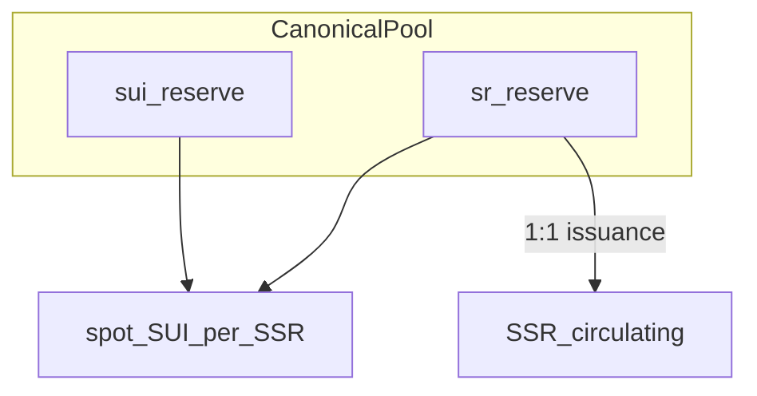

# 代幣經濟規格（Token Economics）

> Status: **Implemented — V0 reserve-ratio 規格已對齊（2026-06-10）**  
> 關聯：CertiK Scan_1（F26、F27、F28/F66）、[`amm_pool.move`](../../contracts/sources/amm_pool.move)

## 摘要

自 **V0** 起，產品設計即為 **reserve-ratio 單向 mint 池**：

- 底層資產 **SR**（`survey_reward`）：發起者花 **SUI** 向池鑄造，鑄出即**自動質押進 `sr_reserve`**；投入的 SUI 同時留在 `sui_reserve` 作為儲備，兩者形成比率決定邊際 mint 價格。
- 流通 **SSR**（`stacked_survey_reward`）：**SR 的可自由交易權利憑證**，與池內 SR **1:1** 發行（`sr_reserve` 即 SSR 全額的鏈上背書）。發起者鑄造取得 SSR、作為填答獎勵發出，故**受訪者領到的是 SR 的權利憑證（SSR）**。
- **pool.admin**（項目方）具受信任的貨幣政策權限（提 SUI、銷毀配對、通膨調節）。

本文件為單一來源規格；[`專案願景.md`](../專案願景.md)、[`History/V1_TDD.md`](../History/V1_TDD.md) 中 bonding curve / 舊 SSR·sSSR 敘述視為文案或實作漂移，**不以之為準**。鏈上／前端／`scripts/src/admin-pool.ts` 已對齊；**需 fresh package publish** 後 devnet 才生效。

---

## 名詞

| 名詞 | Move 模組 | 位置／用途 |
|------|-----------|------------|
| **SR** | `survey_reward` | 底層資產；鑄造時自動質押入 canonical `Pool.sr_reserve`，為 SSR 之鏈上背書 |
| **SSR** | `stacked_survey_reward` | SR 的可自由交易權利憑證；流通於發起者 vault 預算、受訪者 claim 等 |
| **Canonical Pool** | `amm_pool::Pool` | 經 `ProtocolConfig` 登記；唯一合法 mint 池 |
| **pool.admin** | — | 項目方地址；SUI 出池與銷毀配對之執行者 |

### 命名演進（僅供對照）

| 時期 | 池內 | 流通 |
|------|------|------|
| Hackathon 願景文案 | SSR | sSSR（stacked…） |
| **現行規格（V0 起）** | **SR** | **SSR** |

---

## 三條核心不變量



1. **定價**（同一池狀態、同一 1:1 背書，單位方向互為倒數，見 § 定價公式）：
   - **mint 邊際**：`ssr_out / sui_in = sr_reserve / sui_reserve`（每 MIST 可得 SSR base）
   - **現貨錨**：`spot = sui_reserve / sr_reserve`（每 SSR base 對應 MIST）
2. **SUI 出池**：僅 `pool.admin` 可呼叫 `admin_withdraw_sui`——防非 admin 冒領，亦為公開儲備與控價工具。
3. **銷毀**：須 **`split` 池內 `sr_reserve`** 的 SR，並 **銷毀 admin 持有的等量 SSR**；與提 SUI **無需同 tx、可獨立執行**。

**鎖死恆等式**：合法 mint 路徑維持 **SR : SSR = 1 : 1**（base units）。每枚 SSR 都是池內一份等量質押 SR 的權利憑證——`sr_reserve` 即 SSR 全額流通的鏈上背書（非無用鎖倉）。

---

## 定價公式

### 現貨錨

依 §三條核心不變量的鎖死恆等式，談「SSR 計價錨」即談池內 SR 背書量，二者不可分開解讀。

**1 SSR 的 SUI 計價錨**（base units）：

```
spot_SUI_per_SSR = sui_reserve / sr_reserve
```

（`sr_reserve > 0` 時有意義。背書量相對稀缺 → 每 SSR 對應更多 SUI。）

**數值範例**：`sui_reserve = 10_000_000_000` MIST（10 SUI）、`sr_reserve = 5_000_000_000` base（5000 SSR）→ 錨 = 10¹⁰ / (5×10⁹) = **2 MIST/SSR base unit** → 1 SSR（10⁶ base）= 2×10⁶ MIST ≈ **0.002 SUI**。交叉驗證 mint：投入 1 SUI（10⁹ MIST）→ `floor(10⁹ × 5×10⁹ / 10¹⁰) = 5×10⁸ base = 500 SSR`（與 1/0.002 一致）。

### 邊際 mint（`invest_and_mint`）

輸入 `sui_in`（MIST），輸出 `ssr_out`（SSR base units），同時 mint 等量 SR 入 `sr_reserve`。

**雙邊儲備皆 > 0**：

```
ssr_out = floor(sui_in * sr_reserve / sui_reserve)
```

要求：`ssr_out > 0`；呼叫方可傳 `min_ssr_out`，若 `ssr_out < min_ssr_out` 則 abort（**非 admin 發起注資**路徑建議保留滑點保護）。

**比例 mint 性質**：在整數除法下，上式使 invest 後 `sr_reserve' / sui_reserve'` 與 invest 前比率一致（邊際不扭曲池內 SR/SUI 比）。

### Bootstrap（空池或單邊為零）

當 `sui_reserve == 0` **或** `sr_reserve == 0` 時，不適用比率除法，改用 **初始常數**（與現行常數語意對齊）：

```
ssr_out = floor(sui_in * INITIAL_SSR_PER_SUI / 10^(9 - DECIMALS))
```

（`DECIMALS = 6` 時即 `floor(sui_in * INITIAL_SSR_PER_SUI / 1000)`。）

- `INITIAL_SSR_PER_SUI = 1000`（人類單位：1 SUI → 1000 SR/SSR；6 decimals 下 1 SUI = 10⁹ MIST → 10⁹ SSR base）。
- **最小單位對齊**：bootstrap 錨下 **1 SSR base unit = 1 MIST**（1 枚 SSR = 10⁶ base = 0.001 SUI = 10⁶ MIST）。
- **僅**在空池／單邊為零時啟用；一旦 `sui_reserve > 0` 且 `sr_reserve > 0`，一律走比率公式。

### 規格廢止（定價）

`Pool.total_sui_invested` **不得**再參與定價。實作對齊階段可刪除該欄位（已決策）。

---

## 池子操作語意

| 操作 | 主體 | sui_reserve | sr_reserve | 流通 SSR | 經濟效果 |
|------|------|-------------|------------|----------|----------|
| `invest_and_mint` | 發起者／公開 | +sui_in | +ssr_out | +ssr_out | 依 § 定價 mint；SR/SSR 1:1 |
| `admin_withdraw_sui` | admin | −amount | 不變 | 不變 | mint 率（`sr/sui`）↑；SUI 計價錨下降 |
| `admin_burn_pair` | admin | 不變 | −amount（split） | −amount（燒 admin 持有） | mint 率↓；SUI 計價錨上升；緊縮流通 |
| **通膨循環**（規劃能力） | admin | +in 再 −in（淨 0） | +out | +out | 池內 SUI 不變下增發 SSR 流通 |

各操作 **互不強制配對**；項目方依儲備目標組合使用。

### 通膨循環（規劃能力，非漏洞）

admin 可執行：`invest_and_mint` → `admin_withdraw_sui`（同額 SUI）。

- **淨效果**：池內 SUI 回到循環前水平；`sr_reserve` 與流通 SSR 增加。
- **設計意圖**：在不減少池內 SUI 的前提下加大外部流通／通膨；屬 **trusted-admin 貨幣政策**，非 permissionless 攻擊面。
- 「單純增發 SR」若未來有獨立 admin 入口，實作階段再定（**TBD**）；語意上可包含上述循環。

---

## Trusted-admin 與威脅模型

| 類型 | 說明 |
|------|------|
| **Trust assumption** | `pool.admin` = 項目方；具 intentional 提 SUI、銷毀、通膨權限 |
| **審計分類** | Centralization / governance risk；**非**一般使用者可觸發的 exploit |
| **對外防線** | 非 admin 不得 `admin_withdraw_sui`；僅 canonical pool 可 `invest_and_mint`（已緩解 F28/F66 類無許可池） |
| **本模型不防** | 惡意或失職 admin |

---

## 供給上限與會計

- `survey_reward` / `stacked_survey_reward`：`TOTAL_SUPPLY_CAP = 10^19` base units（低於 `u64::MAX`，鏈上型別可行）。
- 小數位 `DECIMALS = 6`（1 枚 = 10⁶ base；最小單位與 1 MIST 對齊，見 § Bootstrap）。
- 人類可讀上限 **10¹³ 枚** SR / SSR（10^19 / 10^6）。
- 每次合法 mint：`sr_reserve += a`，流通 SSR `+= a`（`a` 為 mint 量）。
- 每次合法 `admin_burn_pair`：池內 SR `−= a`，銷毀 SSR `a`（admin 提供 SSR coin）。

---

## 與問卷金流（高層）

- **發起者**：原子 PTB 中 `invest_and_mint` 取得 SSR（SR 權利憑證）→ 注入 [`survey_vault`](../../contracts/sources/survey_vault.move)（建立鏈與協議費規格見 [SurveyLifecycle.md](SurveyLifecycle.md)；歷史紀錄 [`History/V2_改版目標.md`](../History/V2_改版目標.md)）。
- **受訪者**：`survey_vault::claim` 自 vault 餘額取得 SSR（SR 權利憑證）；不經 AMM swap。
- **不恢復** V1 `amm_pool::redeem`（見 [`V4_Tasks.md`](../V4_Tasks.md)）。

---

## 實作對齊（2026-06-10）

| 項目 | 規格 | 程式碼 |
|------|------|--------|
| 邊際定價 | `sr_reserve / sui_reserve` + bootstrap | [`amm_pool.move`](../../contracts/sources/amm_pool.move) `compute_ssr_amount` |
| 定價狀態 | `sui_reserve`、`sr_reserve` | 已移除 `total_sui_invested` |
| `admin_burn_pair` | split 池內 SR + 燒 admin SSR | `admin_burn_pair(pool, …, ssr_in)` |
| decimals / cap | 6 / 10^19 | [`survey_reward.move`](../../contracts/sources/survey_reward.move)、[`stacked_survey_reward.move`](../../contracts/sources/stacked_survey_reward.move) |
| 前端估價 | reserves | [`ptb.ts`](../../frontend/src/lib/ptb.ts)、[`FundPage`](../../frontend/src/pages/FundPage.tsx) |
| Admin 營運 | withdraw / burn / inflate | [`scripts/src/admin-pool.ts`](../../scripts/src/admin-pool.ts)（`pnpm admin:pool`） |
| 測試 | bootstrap、比率、burn | [`contracts/tests/amm_pool_tests.move`](../../contracts/tests/amm_pool_tests.move) |

部署後執行 `pnpm deploy:Devnet` 與 `pnpm certik:smoke:devnet` 複測（Deploy D-6）。

---

## CertiK Finding 定性（Scan_1）

| Finding | 規格下定性 | 備註 |
|---------|------------|------|
| **F26** | **By Design** | `sr_reserve` 為 SSR 背書帳；`admin_burn_pair` 已 split 池內 SR |
| **F27** | **Partial → 待實作對齊後重評** | 比率定價 + `min_ssr_out` 後，一般使用者路徑之排序風險可接受或降級；bonding curve 為實作偏差；admin 政策操作不屬 F27 |
| **F28 / F66** | **Mitigated + Governance** | Canonical pool 已限制 mint 池；admin invest→withdraw 列 trusted-admin 能力，非 permissionless 免費 mint |

回覆草稿可自本節複製；待鏈上對齊後更新 [`CertiK_1_Task.md`](../History/CertiK_1_Task.md) 複測狀態。

---

## 變更紀錄

| 日期 | 說明 |
|------|------|
| 2026-06-10 | 初版：還原 V0 reserve-ratio 規格；標註實作偏差與 CertiK 定性 |
| 2026-06-10 | Bootstrap 匯率 100 SR/SSR per SUI；`TOTAL_SUPPLY_CAP` 調整為 10^19 base units（10¹⁰ 枚） |
| 2026-06-10 | `DECIMALS` 9→7；bootstrap 公式補 `10^(9-DECIMALS)`；最小單位對齊 1 MIST；人類可讀 cap 10¹² 枚 |
| 2026-06-10 | `DECIMALS` 7→6；bootstrap 匯率改回 1000 SR/SSR per SUI；人類可讀 cap 10¹³ 枚 |
| 2026-06-10 | 現貨錨範例與 1:1 背書恆等式對齊；操作表計價錨方向修正 |
| 2026-06-11 | 補 SurveyLifecycle 交叉連結；內容不變 |
| 2026-06-14 | 概念框架對齊：SR＝底層資產(鑄造即自動質押)、SSR＝SR 之可自由交易權利憑證；公式／不變量／數值不變 |
