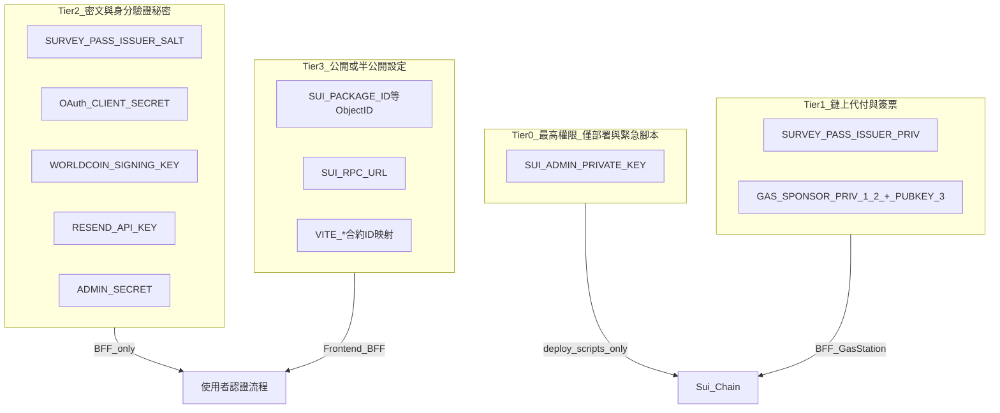

# SurveySui 安全管理指南

> 本文件以**現有程式碼行為**為準，說明專案中所有金鑰與秘密的分層管理、存放方式、輪換流程與上線前檢查。  
> 相關文件：[V4_Tasks.md](./V4_Tasks.md)、[Reset/Reset_SOP.md](./Reset/Reset_SOP.md)、[History/V2_TDD.md](./History/V2_TDD.md)（INV-7）

---

## 1. 概述與原則

### 1.1 基本原則

| 原則 | 說明 |
|------|------|
| **集中設定** | 所有環境變數集中在 repo 根目錄 `.env`（見 [V4_Tasks.md](./V4_Tasks.md) 守則） |
| **最小權限** | BFF 常駐程序不得持有合約 Admin 私鑰 |
| **分環境隔離** | dev / staging / prod 使用不同金鑰與 salt，禁止共用 |
| **永不進版控** | `.env`、私鑰、OAuth secret、API key 不得 commit |
| **前端零秘密** | 瀏覽器 bundle 僅含公開 Object ID 與營運參數 |

### 1.2 上線前待辦（摘自 V4）

- Gas 代付改 2-of-3 multisig（見 §10；ticket 仍單簽）
- 依本文件輪換準則重設所有 Secrets
- 確認 OAuth JWT 驗簽、Admin API 權限、Gas 限額設定

---

## 2. 分層管理模型

秘密依**洩漏影響**與**可輪換難度**分為四層。較高層級的憑證應限制在越少元件、越少人員手中越好。



### 各層摘要

| 層級 | 代表變數 | 誰可持有 | 洩漏影響 | 輪換 |
|------|----------|----------|----------|------|
| **Tier 0** | `SUI_ADMIN_PRIVATE_KEY` | 部署腳本、緊急 rescue 腳本 | 可改動合約治理、資金相關能力 | 中等（需鏈上 capability 遷移） |
| **Tier 1** | `SURVEY_PASS_ISSUER_PRIV`（ticket）；`GAS_SPONSOR_PRIV_1/2` + `GAS_SPONSOR_PUBKEY_3`（代付 multisig） | BFF（ticket + 代付）；Gas Station Worker（僅代付） | Ticket：偽造 Pass ticket。代付：竊 1 把熱鍵無法單獨轉池；竊 Worker 環境可能失兩把熱鍵 | 中等 |
| **Tier 2** | Salt、OAuth、API keys | BFF（及部署腳本部分項） | 身分偽造、nullifier 可破解、管理 API 被濫用 | 簡單～極難（見 §7） |
| **Tier 3** | Object ID、RPC URL、Gas 限額 | 前端 + BFF | 資訊公開，主要為設定錯誤風險 | 隨部署更新 |

---

## 3. 秘密與金鑰完整盤點

以下表格依程式碼實際讀取位置整理。路徑相對於 repo 根目錄。

### 3.1 Tier 0 — 合約 Admin（最高權限）

| 變數 | 秘密？ | 用途 | 讀取位置 |
|------|--------|------|----------|
| `SUI_ADMIN_PRIVATE_KEY` | **是** | 部署 Move package、admin rescue | `scripts/src/init.ts`, `scripts/src/admin_rescue.ts` |
| `SUI_ADMIN_ADDRESS` | 否（公鑰地址） | 與 admin 私鑰配對；前端顯示 treasury | 同上；`frontend/vite.config.ts` → `VITE_ADMIN_ADDRESS` |

**BFF 行為**：啟動時會 `delete process.env.SUI_ADMIN_PRIVATE_KEY`，且 `assertSecureEnv()` 若偵測到 admin key 會直接 crash（見 §6）。

### 3.2 Tier 1 — Ticket 簽名與 Gas 代付（Phase 2-lite 分離）

| 變數 | 秘密？ | 用途 | 讀取位置 |
|------|--------|------|----------|
| `SURVEY_PASS_ISSUER_PRIV` | **是** | Pass ticket Ed25519 簽名（鏈上 `issuer_pubkey`） | `bff/src/auth/ticket.ts`, `bff/src/gas/handler.ts`（僅驗 ticket） |
| `GAS_SPONSOR_PRIV_1`, `GAS_SPONSOR_PRIV_2` | **是** | 2-of-3 multisig 熱簽名（K1+K2） | `packages/gas-station-core/src/signerBackend.ts`, BFF 代付／merge／purge／pass delete, `workers/gas-station/` |
| `GAS_SPONSOR_PUBKEY_3` | 否（公鑰 hex） | 冷備 K3 公鑰，組 multisig 地址 | 同上 |
| `GAS_SPONSOR_MULTISIG_THRESHOLD` | 否 | 預設 `2` | 同上 |
| `GAS_SPONSOR_ADDRESS` | 否 | 可選；健康檢查與 env 校驗 | 同上 |

**現況（Phase 2-lite）**：Ticket 與代付金鑰已分離。代付路徑透過 `createSponsorSignerFromEnv()` 載入 2-of-3 multisig；K3 私鑰僅在 `scripts/src/setup-multisig-sponsor.ts` 產生並離線保存。

**Dev fallback**：未設 `GAS_SPONSOR_*` 時，非 production 可暫用 `SURVEY_PASS_ISSUER_PRIV` 作單簽代付（`console.warn`）；production 強制 multisig env。

**設定腳本**：`pnpm --filter @surveysui/scripts exec tsx src/setup-multisig-sponsor.ts`

### 3.3 Tier 2 — 密文與 API 秘密

| 變數 | 秘密？ | 用途 | 讀取位置 | 輪換難度 |
|------|--------|------|----------|----------|
| `SURVEY_PASS_ISSUER_SALT` | **是** | Nullifier pepper（Email / Social / World ID） | `bff/src/config.ts` → `getIssuerSalt()` | **極難** |
| `GOOGLE_OAUTH_CLIENT_ID` | 半公開 | Google OAuth | `bff/src/auth/oauthProviders.ts` | 簡單 |
| `GOOGLE_OAUTH_CLIENT_SECRET` | **是** | Google token exchange | 同上 | 簡單 |
| `GITHUB_OAUTH_CLIENT_ID` | 半公開 | GitHub OAuth | 同上 | 簡單 |
| `GITHUB_OAUTH_CLIENT_SECRET` | **是** | GitHub token exchange | 同上 | 簡單 |
| `WORLDCOIN_SIGNING_KEY` | **是** | World ID 驗證請求簽名 | `bff/src/auth/worldId.ts` | 簡單 |
| `WORLDCOIN_APP_ID` | 半公開 | World ID app 識別 | `bff/src/auth/handler.ts` | 簡單 |
| `WORLDCOIN_RP_ID` | 半公開 | Relying Party ID | `bff/src/auth/worldId.ts` | 簡單 |
| `WORLDCOIN_ACTION` | 否 | 驗證 action 名稱 | `bff/src/auth/handler.ts`, `worldId.ts` | 簡單 |
| `WORLDCOIN_API_BASE` | 否 | World ID API 端點（可選） | `bff/src/auth/worldId.ts` | 簡單 |
| `ZKLOGIN_SALT_SECRET` | **legacy** | 自架 zkLogin 地址推導（**已廢棄**，runtime 未使用） | 僅歷史文件／E2E 占位 | — |
| `ZKLOGIN_PROVER_URL` | **legacy** | 自架 zkLogin Prover（**已廢棄**） | 無 | — |
| `RESEND_API_KEY` | **是** | Email OTP 寄送 | `bff/src/email/sender.ts` | 簡單 |
| `ADMIN_SECRET` | **是** | `/api/admin/revocation/*` Bearer 驗證 | `bff/src/security/revocation_handler.ts` | 簡單 |
| `DEV_MNEMONIC` | **是** | 本機測試錢包助記詞 | `scripts/src/devAccounts.ts` 等 | 僅 dev |

**Salt 說明**：`getIssuerSalt()` 會拒絕未設定、空字串、`default_salt`、長度 &lt; 12 的值。Nullifier 隱私依賴此 pepper；變更 salt 會使所有既有 nullifier hash 失效，需產品層決策（見 §7.3）。

### 3.4 Tier 3 — 公開鏈上 ID 與營運設定

#### 鏈上 Object ID（非秘密，需隨部署更新）

| 變數 | 前端映射（`vite.config.ts`） |
|------|------------------------------|
| `SUI_PACKAGE_ID` | `VITE_PACKAGE_ID` |
| `AMM_POOL_ID` | `VITE_AMM_POOL_ID` |
| `SR_TREASURY_ID` | `VITE_SR_TREASURY_ID` |
| `SSR_TREASURY_ID` | `VITE_SSR_TREASURY_ID` |
| `SURVEY_REGISTRY_ID` | `VITE_SURVEY_REGISTRY_ID` |
| `PASS_REGISTRY_ID` | `VITE_PASS_REGISTRY_ID` |
| `NULLIFIER_REGISTRY_ID` | `VITE_NULLIFIER_REGISTRY_ID`（fallback: PASS_REGISTRY） |
| `ISSUER_CONFIG_ID` | `VITE_ISSUER_CONFIG_ID` |
| `SUI_ADMIN_ADDRESS` | `VITE_ADMIN_ADDRESS` |

#### 網路與服務 URL

| 變數 | 用途 |
|------|------|
| `SUI_NETWORK` | 網路名稱（scripts） |
| `SUI_RPC_URL` | Sui RPC 端點 |
| `BFF_URL` / `VITE_BFF_URL` | BFF 對外 URL |
| `FRONTEND_URL` | OAuth redirect、CORS 相關 |
| `PORT` | BFF 監聽埠 |
| `EMAIL_FROM` | 寄件者地址（非秘密） |

#### Gas 代付與限額（`packages/gas-station-core/src/gasConfig.ts`）

| 變數 | 預設用途 |
|------|----------|
| `GAS_BUDGET_CAP_MIST` | 單筆代付 gas budget 上限 |
| `GAS_BUDGET_BUFFER_MIST` | Budget 緩衝 |
| `MIN_GAS_COMPENSATION_AMOUNT` / `GAS_COMPENSATION_AMOUNT` | 最低補償量 |
| `MAX_PLATFORM_CLAIM_GAS_MIST` | 平台 claim 代付上限 |
| `PLATFORM_SPONSOR_DAILY_LIMIT` | 每地址每日平台代付次數 |
| `MIN_PLATFORM_SPONSOR_TIER` | 平台代付最低 Pass tier |
| `GAS_SPONSOR_RATE_LIMIT_*` | 全站／每錢包頻控 |
| `COIN_MERGE_*` | Coin 合併背景任務 |
| `COIN_QUEUE_*` | 分散式 coin queue（DO 模式） |
| `SPONSOR_COUNT_SCOPE` | 代付次數計數範圍 | `bff/src/gas/sponsorPolicy.ts` |

#### Gas Station 分散式模式

| 變數 | 用途 |
|------|------|
| `GAS_STATION_MODE` | `local`（BFF 內簽）或 `do`（轉發 Worker） |
| `GAS_STATION_URL` | Worker 基底 URL（`do` 模式必填） |

#### 註銷與生命週期

| 變數 | 用途 |
|------|------|
| `REVOCATION_MINT_GUARD_ENABLED` | Mint 前檢查 revoked nullifier |
| `REVOCATION_MINT_TICKET_RATE_LIMIT_HOURS` | Mint ticket 頻控 TTL |
| `PURGE_TASK_ENABLED` | 自動銷毀背景任務 |
| `PURGE_SCAN_INTERVAL_MS` / `PURGE_MAX_PER_CYCLE` | Purge 掃描參數 |
| `PURGE_REBATE_REFUND_ENABLED` / `PURGE_REBATE_CREATOR_SHARE_BPS` | 銷毀返還設定 |
| `MAX_INLINE_ANSWER_BYTES` / `MAX_INLINE_ANSWER_KB` | 答卷直傳鏈上大小上限 |
| `BFF_PASS_TTL_MS_EMAIL` / `BFF_PASS_TTL_MS_SOCIAL` | Pass ticket 效期 |
| `TICKET_FEE_MIST` | Ticket 手續費（映射至前端） |
| `VITE_WALRUS_*` / `VITE_PURGE_GRACE_MS` 等 | 前端營運參數 |

### 3.5 明確禁止進前端的秘密

以下模式**不得**出現在前端 bundle 或 `VITE_*` 注入中：

- `*_PRIVATE_KEY`、`*_PRIV`
- `*_CLIENT_SECRET`、`*_SIGNING_KEY`、`*_API_KEY`
- `ADMIN_SECRET`、`SURVEY_PASS_ISSUER_SALT`、`DEV_MNEMONIC`

前端透過 Vite dev proxy 呼叫 BFF 的 `/auth`、`/api`、`/stats` 等路徑（`frontend/vite.config.ts`），OAuth 與 ticket 簽發均在伺服器端完成。

---

## 4. 各元件持有範圍

| 元件 | 應持有 | 不得持有 |
|------|--------|----------|
| **BFF**（`bff/`） | Tier 1–2：ticket 私鑰、gas sponsor K1/K2 + K3 公鑰、salt、OAuth、World ID、Resend、`ADMIN_SECRET` | `SUI_ADMIN_PRIVATE_KEY` |
| **Gas Station Worker**（`workers/gas-station/`） | `GAS_SPONSOR_PRIV_1/2`、`GAS_SPONSOR_PUBKEY_3`、Gas 設定、D1 binding | Admin 私鑰、`SURVEY_PASS_ISSUER_PRIV`（已廢棄） |
| **部署腳本**（`scripts/`） | Tier 0；必要時 Tier 2 | 不應作為常駐服務 |
| **Frontend**（`frontend/`） | Tier 3 `VITE_*`、公開 URL | 一切 Tier 0–2 秘密 |
| **開發者本機** | 完整 `.env`（gitignored） | 勿 commit、勿在公開頻道貼值 |

---

## 5. 存放與注入方式

### 5.1 本機開發

- 在 repo 根目錄維護單一 `.env`
- `frontend/vite.config.ts` 與 `bff` 啟動流程皆從根目錄讀取
- 確認 `.env` 在 `.gitignore` 內

### 5.2 BFF 生產環境

- 使用託管平台 Secrets（Fly.io、Render 等），**不要** bake 進 Docker image 或寫死在 Dockerfile
- 部署後確認程序環境中**沒有** `SUI_ADMIN_PRIVATE_KEY`

### 5.3 Cloudflare Gas Station Worker

- 敏感項：`wrangler secret put SURVEY_PASS_ISSUER_PRIV`（及同 tier 秘密）
- 非敏感預設：寫在 `workers/gas-station/wrangler.toml` 的 `[vars]`（如 `SUI_RPC_URL`）
- D1 database binding 在 `wrangler.toml` 設定，不含私鑰

範例：

```bash
cd workers/gas-station
wrangler secret put SURVEY_PASS_ISSUER_PRIV
```

### 5.4 CI / 測試

- `frontend/playwright.config.ts` 對測試用 secret 使用空字串或 fixture 值
- 若 CI 需整合測試，使用 GitHub Actions **Encrypted Secrets**，勿寫入 workflow 明文

### 5.5 產生高熵秘密建議

```bash
# Linux / macOS / Git Bash
openssl rand -hex 32
```

`ADMIN_SECRET`、`SURVEY_PASS_ISSUER_SALT` 建議至少 32 字節隨機（或等效熵）。

---

## 6. 現有程式化防護（已實作）

### 6.1 INV-7：BFF 拒絕 Admin 私鑰

**檔案**：`bff/src/security.ts`、`bff/src/index.ts`

```typescript
// bff/src/security.ts
export function assertSecureEnv(): void {
  if (process.env.SUI_ADMIN_PRIVATE_KEY) {
    throw new Error('BFF must not hold admin TX key')
  }
  // ...
}
```

```typescript
// bff/src/index.ts — 啟動時先刪除根 .env 載入的 admin key
delete process.env.SUI_ADMIN_PRIVATE_KEY
assertSecureEnv()
```

**測試**：`bff/src/__tests__/security.test.ts`（`test_bff_refuses_admin_tx_key`）

### 6.2 Nullifier Salt 強度檢查

**檔案**：`bff/src/config.ts` — `getIssuerSalt()`

- 未設定或空白 → throw
- 等於 `default_salt` → throw
- 長度 &lt; 12 → throw

**測試**：`bff/tests/config.test.ts`

### 6.3 Admin API Bearer 驗證

**檔案**：`bff/src/security/revocation_handler.ts`

- 路由：`POST /api/admin/revocation/revoke`、`/unrevoke`
- Header：`Authorization: Bearer ${ADMIN_SECRET}`
- 未設定 `ADMIN_SECRET` → 500 `server_misconfigured`

### 6.4 Gas 設定一致性

**檔案**：`packages/gas-station-core/src/gasConfig.ts` — `assertGasConfig()`

啟動時驗證例如 `MAX_PLATFORM_CLAIM_GAS_MIST <= GAS_BUDGET_CAP_MIST` 等不變量，避免錯誤設定導致超額代付。

### 6.5 OAuth / World ID（上線前確認）

- OAuth：token exchange 在 BFF 完成，client secret 不離開伺服器（`bff/src/auth/handler.ts`）
- World ID：BFF 以 `WORLDCOIN_SIGNING_KEY` 簽署驗證請求（`bff/src/auth/worldId.ts`）
- **上線前**：確認 IdP JWT / World ID proof 驗簽路徑已啟用且 redirect URI 與 prod 網域一致（見 [V4_Tasks.md](./V4_Tasks.md) 收尾檢查）

### 6.6 代付濫用防護（營運層）

- 平台／錢包 rate limit（SQLite / D1 stores）
- `MIN_PLATFORM_SPONSOR_TIER`、inline answer 大小上限
- Mint guard：`REVOCATION_MINT_GUARD_ENABLED`

細節見 Gas 相關模組與 [V4_Tasks.md](./V4_Tasks.md) 進度紀錄。

---

## 7. 輪換 Runbook

### 7.1 簡單輪換（影響小，可隨時執行）

適用：`GOOGLE_OAUTH_CLIENT_SECRET`、`GITHUB_OAUTH_CLIENT_SECRET`、`RESEND_API_KEY`、`ADMIN_SECRET`、`WORLDCOIN_SIGNING_KEY`

| 步驟 | 動作 |
|------|------|
| 1 | 在對應 SaaS 後台產生新 secret／撤銷舊 secret |
| 2 | 更新 prod `.env` 或平台 Secrets |
| 3 | 重啟 BFF（及有讀取該變數的 Worker） |
| 4 | 驗證：OAuth 登入、Email OTP、admin revocation API、World ID 各走一輪 |

**回滾**：還原舊 env 值並重啟（若 SaaS 尚未撤銷舊 secret）。

**使用者影響**：進行中 OAuth flow 可能需重新登入；其餘通常無感。

### 7.2 中等輪換 — Issuer 私鑰

適用：`SURVEY_PASS_ISSUER_PRIV`

| 步驟 | 動作 |
|------|------|
| 1 | 產生新 Ed25519 keypair，記錄新地址 |
| 2 | 將舊 issuer 地址上剩餘 SUI 轉至新地址（或保留舊地址僅作廢） |
| 3 | 確認鏈上 `ISSUER_CONFIG` 是否綁定 issuer 公鑰；若需更新，使用 **Tier 0 admin** 執行對應鏈上操作 |
| 4 | 更新 BFF 與 Gas Station Worker 的 `SURVEY_PASS_ISSUER_PRIV` |
| 5 | 重啟 BFF、Worker；觀察 `/health`、代付成功率、coin merge log |
| 6 | 監控新地址餘額與異常 outbound 交易 |

**回滾**：還原舊私鑰 env（僅在舊 key 未洩漏且仍控制該地址時）。

**使用者影響**：輪換窗口內代付可能短暫失敗；已發行 Pass 通常不受影響（ticket 已上鏈）。

**成本注意**：新地址需預留足夠 SUI 作為代付池；coin merge 任務依新 keypair 運作。

### 7.3 困難輪換 — Issuer Salt

適用：`SURVEY_PASS_ISSUER_SALT`

**不建議**在已有真實用戶後輪換。變更 salt 會改變所有 nullifier 計算結果，可能導致：

- 同一使用者可重新 mint（若鏈上未記錄舊 nullifier）
- 或與既有 Pass／revocation DB 不一致

若必須輪換，需產品決策：

1. **凍結 mint**，遷移 revocation 資料，或
2. 引入 **salt 版本號**（需程式與合約配合，目前未實作）

### 7.4 Legacy — 自架 zkLogin Salt（已廢棄）

> 專案已放棄自架 zkLogin（見 [V4_Tasks.md](./V4_Tasks.md)）。以下僅供歷史參考；**現行部署不需設定** `ZKLOGIN_SALT_SECRET` / `ZKLOGIN_PROVER_URL`。

適用：`ZKLOGIN_SALT_SECRET`（legacy）

若曾啟用自架 zkLogin，設定後**嚴禁更換**，否則 zkLogin 用戶推導出的 Sui 地址會改變。

### 7.5 Admin 私鑰輪換

適用：`SUI_ADMIN_PRIVATE_KEY`

- 影響：未來部署、鏈上 admin capability 操作
- 新 key 需透過 Move 治理流程取得對應權限（細節見合約與部署文件）
- **BFF 永遠不應載入此 key**

---

## 8. 上線前檢查清單

部署正式環境前，逐項確認：

- [ ] dev / staging / prod 使用**不同**的 Tier 0–2 秘密（非測試用 placeholder）
- [ ] BFF 環境變數中**無** `SUI_ADMIN_PRIVATE_KEY`；啟動 log 無 admin key 錯誤
- [ ] `SURVEY_PASS_ISSUER_SALT` 通過 `getIssuerSalt()` 檢查（非 `default_salt`、足夠長）
- [ ] `ADMIN_SECRET` 已設定（建議 `openssl rand -hex 32`）
- [ ] OAuth redirect URI 與 `BFF_URL` / prod 網域一致
- [ ] `RESEND_API_KEY`、`WORLDCOIN_*` 使用 production 憑證
- [ ] Gas Station Worker secrets 已透過 `wrangler secret` 注入（若使用 `GAS_STATION_MODE=do`）
- [ ] `assertGasConfig()` 通過；代付限額符合預算
- [ ] `REVOCATION_MINT_GUARD_ENABLED=true`（建議）
- [ ] Issuer 地址 SUI 餘額高於 `healthMinBalanceMist` 建議值
- [ ] **重設所有 Secrets**（相對於 dev 曾外洩或 commit 過的值）
- [ ] Gas 代付 multisig 已設定（`GAS_SPONSOR_*`）；代付池 SUI 在 multisig 地址上
- [ ] Ticket 金鑰（`SURVEY_PASS_ISSUER_PRIV`）與代付金鑰分離；Gas Worker 無 ticket 私鑰
- [ ] 團隊已閱讀 §9 洩漏應變流程

---

## 9. 洩漏應變摘要

| 洩漏項目 | 立即動作 | 後續 |
|----------|----------|------|
| `SURVEY_PASS_ISSUER_PRIV` | 停止 BFF ticket 簽發；鏈上 `set_issuer_pubkey` 輪換 | §7.2 ticket 輪換 |
| `GAS_SPONSOR_PRIV_1` 或 `_2` | 停止 BFF / Gas Worker；監控 multisig sponsor 地址 | 產生新 multisig（`setup-multisig-sponsor.ts`）；轉移池餘額；輪換 wrangler secrets |
| `SURVEY_PASS_ISSUER_SALT` | 視為 nullifier 隱私失效 | 評估強制重新認證；長期需 salt 版本化方案 |
| OAuth client secret | 在 Google / GitHub 撤銷舊 secret | §7.1 輪換 |
| `ADMIN_SECRET` | 輪換 secret；檢查 revocation API 異常呼叫 log | 調查是否被寫入 revoked nullifier |
| `RESEND_API_KEY` | Resend 後台撤銷 key | §7.1 輪換 |
| `SUI_ADMIN_PRIVATE_KEY` | 評估鏈上 admin 操作紀錄；準備 capability 轉移 | 產生新 admin key；**勿**部署到 BFF |

**通報**：記錄洩漏時間、可能暴露範圍（repo、log、截圖、CI artifact），並更新本文件輪換紀錄（建議團隊內部維護一份輪換日誌）。

---

## 10. 代付 Multisig（Phase 2-lite）與後續 KMS

**已實作（Phase 2-lite）**

- 2-of-3 Sui multisig 作為 gas sponsor 地址；runtime 僅載入 K1+K2 + K3 公鑰
- `packages/gas-station-core/src/signerBackend.ts` — `SponsorSigner`、`MultisigSponsorSigner`、`createSponsorSignerFromEnv`
- 設定：`scripts/src/setup-multisig-sponsor.ts`；架構摘要見 [託管架構.md](./託管架構.md)

**尚未實作（Phase 3+）**

- 商業 KMS / HSM 託管熱鍵
- Ticket issuer threshold multisig
- 全 BFF 遷移至 Cloudflare Worker `api`

---

## 11. `.env` 分區建議（註解用）

在根目錄 `.env` 中可用註解分區，便於維護（值請自行填入，**勿 commit**）：

```env
# ── Tier 0：僅部署腳本 ──
# SUI_ADMIN_PRIVATE_KEY=
# SUI_ADMIN_ADDRESS=

# ── Tier 1：BFF ticket + Gas sponsor multisig ──
# SURVEY_PASS_ISSUER_PRIV=
# GAS_SPONSOR_PRIV_1=
# GAS_SPONSOR_PRIV_2=
# GAS_SPONSOR_PUBKEY_3=
# GAS_SPONSOR_MULTISIG_THRESHOLD=2
# GAS_SPONSOR_ADDRESS=

# ── Tier 2：BFF 秘密 ──
# SURVEY_PASS_ISSUER_SALT=
# ADMIN_SECRET=
# GOOGLE_OAUTH_CLIENT_ID=
# GOOGLE_OAUTH_CLIENT_SECRET=
# GITHUB_OAUTH_CLIENT_ID=
# GITHUB_OAUTH_CLIENT_SECRET=
# WORLDCOIN_APP_ID=
# WORLDCOIN_RP_ID=
# WORLDCOIN_SIGNING_KEY=
# WORLDCOIN_ACTION=
# RESEND_API_KEY=
# (legacy, 勿設定) ZKLOGIN_SALT_SECRET=

# ── Tier 3：鏈上 ID（deploy 後寫入）──
# SUI_PACKAGE_ID=
# ...

# ── Tier 3：營運參數 ──
# SUI_RPC_URL=
# GAS_BUDGET_CAP_MIST=
# GAS_STATION_MODE=local
```

完整變數清單見 §3；devnet 重置後更新 ID 流程見 [Reset/Reset_SOP.md](./Reset/Reset_SOP.md)。

---

## 12. 相關文件

| 文件 | 內容 |
|------|------|
| [V4_Tasks.md](./V4_Tasks.md) | 上線待辦、收尾檢查、Gas Station 進度 |
| [Reset/Reset_SOP.md](./Reset/Reset_SOP.md) | Devnet 重置、Tier1 env、zkLogin 注意事項 |
| [History/V2_TDD.md](./History/V2_TDD.md) | INV-7 BFF 無 admin key 測試規格 |
| [History/專案 SurveyPass 方案.md](./History/專案%20SurveyPass%20方案.md) | World ID env 說明 |

---

*文件版本：2026-06-08 · 隨程式碼變更請同步更新 §3 盤點表。*
