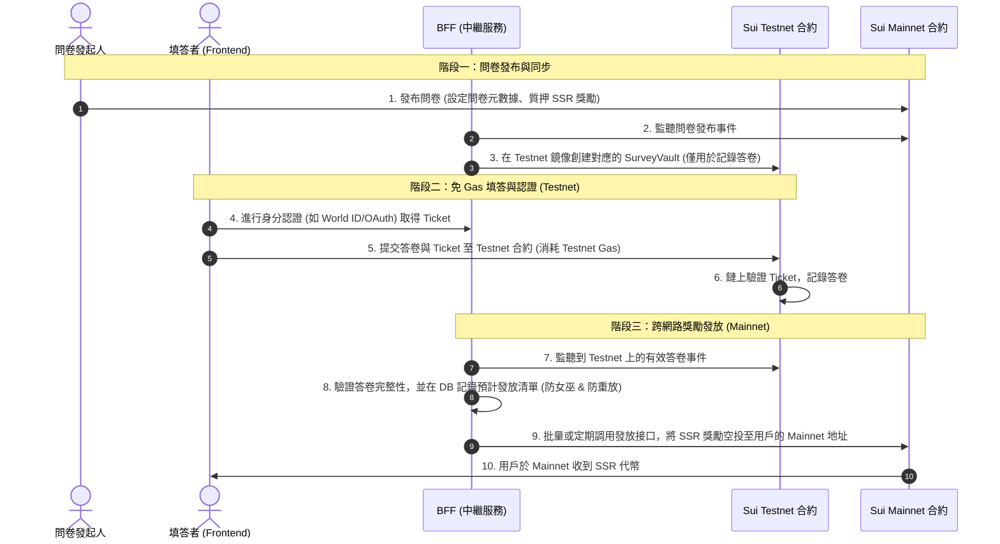

# 專案跨網路方案 (Cross-Network Architecture) 設計與安全評估

本文件旨在評估與定義 SurveySui 透過「跨網路（Sui Mainnet & Testnet 混合）」架構，徹底消除受訪者填答問卷與身份認證時所需 Gas 費用的痛點。本專案的「跨網路方案」並非要在不同區塊鏈之間橋接資金，而是要在 Sui 的主網 (Mainnet) 與測試網 (Testnet) 之間橋接填答資訊與認證狀態。

*   Sui Testnet：充當 Mainnet 的 L2 緩衝網路，利用其免費的 Gas（水龍頭）讓用戶零成本進行高頻、大流量的填答與身分認證。
*   Sui Mainnet：作為最終的價值與信任結算層，負責問卷發布、獎勵代幣（SSR）的結算與防刷 KYC 憑證的最終記錄。

---

## 跨網路混合架構 (Mainnet-Testnet Hybrid)

此方案的核心邏輯是將「需要受訪者支付 Gas」的填答與認證步驟放到 Testnet，而將「價值分配與合規控制」留在 Mainnet，並透過 BFF 作為雙向中繼（Relay Bridge）。

### 1. 發布端 (Mainnet & IPFS/Walrus)
*   發起人操作：發起人在 Sui Mainnet 創建問卷金庫 (`SurveyVault`)，設定問卷獎勵總額，並將 SSR 代幣鎖定在 Mainnet 合約中。
*   儲存優化：為了進一步減少 Mainnet 上的儲存開銷，問卷本體（題目、選項等 JSON 結構）應直接存放在去中心化儲存網路（如 IPFS 或/且 Walrus），Mainnet 合約中僅保存該內容的 Content ID (CID)。

### 2. 填答端 (Testnet)
*   受訪者操作：受訪者在前端載入問卷，並在 Sui Testnet 構建與發送交易。
*   Gas 來源：Testnet 上的交易 Gas 由前端引導用戶向 Testnet 水龍頭領取，對平台和用戶而言為 "零成本"。

### 3. 中繼橋接 (BFF Relay)
*   BFF 充當跨網路橋接器：
    1.  同步問卷：監聽到 Mainnet 創建問卷後，在 Testnet 同步建立一個鏡像問卷結構。 **_考慮是否同步建立問卷 Vault_**  
    2.  監聽與驗證：監聽 Testnet 的 `SurveyVault` 答卷提交事件。收到答卷後，BFF 在鏈下進行資料驗證（如驗證填答內容是否完整、**_是否有合格的 Pass_**）。
    3.  **_鏈上合約再檢查一次提交是否合格_**
    4.  **_如果有建鏡像 Vault，也將 SSR 轉給填答者_**
    5.  觸發結算：將通過驗證的填答紀錄打包，以項目方的 Admin 身份在 Mainnet 上觸發 `claim_reward` 交易。 **_可以考慮非同步結算，n分鐘或n筆結算一次_**

### 4. 結算端 (Mainnet)
*   Sui Mainnet 接收到 BFF 的結算指令後，直接將對應的 SSR 代幣從 Mainnet `SurveyVault` 釋放給填答者的 Mainnet 錢包地址。

---

## SurveyPass 身分認證跨網路優化

身分認證（SurveyPass）具有「與填問卷不同步」且「可重複使用」的特性。若每次用戶領取/更新憑證都要實際支付 Gas 費，會大幅降低用戶意願。

### 跨網路認證機制：
1.  Testnet 註冊與更新：用戶的 SurveyPass **_草稿_** 部署在 Sui Testnet。所有添加與移除都先在 Testnet 上執行。
2.  BFF 驗證與簽發：BFF 驗證用戶的認證資料後，**_視等級和內容，在 Mainnet 上發行正式的 Pass( SBT )_**。
3.  身分認證系統的規劃細節仍未完成，先預留功能及指引文件 `專案 Survey Pass 跨網路簽發指引`。

---

## 跨網路方案 vs. Gas Station 雙層代付

這兩個方案並非互斥，而是解決不同情境下 Gas 痛點的互補策略：

| 比較維度   | 跨網路方案 (Mainnet-Testnet Hybrid)                                                    | Gas Station 雙層代付 (Mainnet Sponsorship)                                |
| :--------- | :------------------------------------------------------------------------------------- | :------------------------------------------------------------------------ |
| 運作網路   | 填答在 Testnet，發獎在 Mainnet                                                         | 全程在 Mainnet 進行交易                                                   |
| Gas 消耗   | 無主網 Gas 消耗（僅消耗無價值的 Testnet Gas）                                          | 發起人/項目方支付 真金白銀的 Mainnet SUI                                  |
| 適合場景   | 大樣本、低客單價、高頻 的大眾普查問卷，或高頻更新的 SurveyPass KYC 認證。              | 小樣本、高客單價、強即時性、高安全性 的金融/去中心化治理（DAO）投票問卷。 |
| 受訪者體驗 | 用戶需要切換錢包網路至 Testnet 進行填答，並在 Mainnet 收獎（體驗摩擦略高，但 0 Gas）。 | 用戶無需切換網路，在 Mainnet 0 餘額直接填答與收獎（體驗最流暢）。         |
| 實作複雜度 | 高。需要 BFF 實現健全的跨網絡監聽、防重放、異步補償隊列。                              | 中。合約支援 PTB 補償，BFF 進行 Dry Run 簽名即可。                        |
